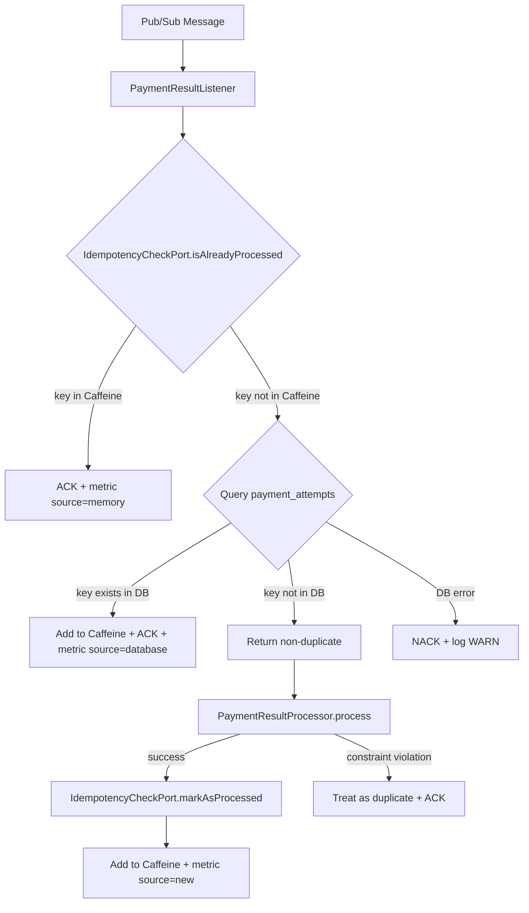
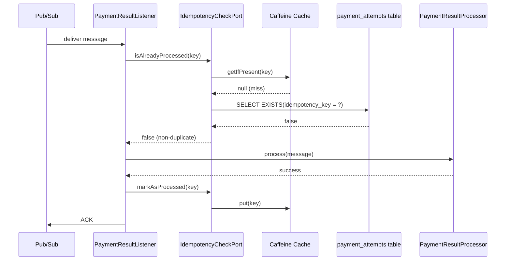
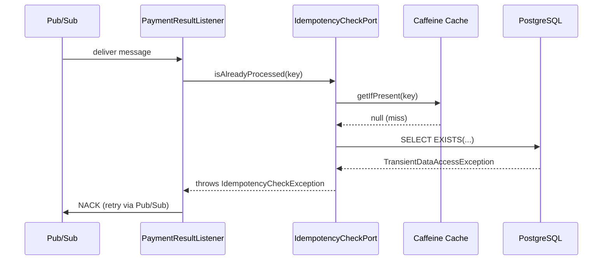

# Design Document: Durable Idempotency Check

## Overview

This feature enhances the `PaymentResultListener`'s idempotency mechanism by adding a durable second layer backed by the existing `payment_attempts` table in PostgreSQL, while retaining an in-memory Caffeine cache as a fast-path for rapid Pub/Sub redeliveries.

The solution follows a cache-aside pattern with two layers:
1. **Caffeine Cache (L1)**: Local in-memory verification with bounded size and eviction — avoids database queries for redeliveries happening on the same instance.
2. **PostgreSQL `payment_attempts` (L2)**: Durable source of truth shared across instances — survives restarts and works in multi-instance deployments.

### Design Decisions

| Decision | Rationale |
|----------|-----------|
| Caffeine instead of ConcurrentHashMap | Native support for max-size with LRU eviction, metrics, and externalized configuration via Spring properties |
| Use existing `payment_attempts` table instead of a separate table | Table already exists with UNIQUE constraint on `idempotency_key`, avoids data duplication and reduces complexity |
| Port interface for idempotency | Follows the project's hexagonal architecture, enables unit testing without database |
| Nack on DB failure | Preserves at-least-once delivery via Pub/Sub retry, no message loss |
| Register in cache after processing (not before) | Avoids false-positive if processing fails before commit |
| Dedicated `IdempotencyCheckException` | Allows `PaymentResultListener` to distinguish transient DB failures (nack) from constraint violations (ack) |

## Architecture



### Sequence Diagram — Happy Path (new message)



### Sequence Diagram — DB Failure during check



## Components and Interfaces

### Port Interface (Application Layer)

```java
package com.globo.subscription.application.port;

/**
 * Port interface for idempotency verification.
 * Provides two-layer duplicate detection: in-memory cache + durable database check.
 */
public interface IdempotencyCheckPort {

    /**
     * Checks if the given idempotency key was already processed.
     * First checks in-memory cache, then queries the database.
     *
     * @param idempotencyKey the unique key to verify
     * @return true if the key was already processed (duplicate), false otherwise
     * @throws IdempotencyCheckException if database is unavailable (transient error)
     */
    boolean isAlreadyProcessed(String idempotencyKey);

    /**
     * Records that the given idempotency key has been successfully processed.
     * Adds the key to the in-memory cache.
     * The database record is persisted as part of the PaymentResultProcessor transaction.
     *
     * @param idempotencyKey the unique key to mark as processed in cache
     */
    void markAsProcessed(String idempotencyKey);
}
```

### Custom Exception

```java
package com.globo.subscription.application.exception;

/**
 * Thrown when idempotency check fails due to transient database error.
 * Signals the listener to NACK the message for redelivery.
 */
public class IdempotencyCheckException extends RuntimeException {
    public IdempotencyCheckException(String message, Throwable cause) {
        super(message, cause);
    }
}
```


### Adapter Implementation (outbound/idempotency)

```java
package com.globo.subscription.adapter.outbound.idempotency;

import com.github.benmanes.caffeine.cache.Cache;
import com.github.benmanes.caffeine.cache.Caffeine;
import com.globo.subscription.adapter.outbound.persistence.repository.PaymentAttemptJpaRepository;
import com.globo.subscription.application.exception.IdempotencyCheckException;
import com.globo.subscription.application.port.IdempotencyCheckPort;
import io.micrometer.core.instrument.Counter;
import io.micrometer.core.instrument.MeterRegistry;
import org.slf4j.Logger;
import org.slf4j.LoggerFactory;
import org.springframework.beans.factory.annotation.Value;
import org.springframework.dao.DataAccessException;
import org.springframework.stereotype.Component;

import java.util.concurrent.TimeUnit;

@Component
public class DurableIdempotencyAdapter implements IdempotencyCheckPort {

    private static final Logger log = LoggerFactory.getLogger(DurableIdempotencyAdapter.class);

    private final Cache<String, Boolean> cache;
    private final PaymentAttemptJpaRepository paymentAttemptRepository;
    private final Counter memoryDuplicateCounter;
    private final Counter databaseDuplicateCounter;
    private final Counter newMessageCounter;

    public DurableIdempotencyAdapter(
            @Value("${cache.idempotency.max-size:50000}") long maxSize,
            @Value("${cache.idempotency.ttl-minutes:30}") long ttlMinutes,
            PaymentAttemptJpaRepository paymentAttemptRepository,
            MeterRegistry meterRegistry) {
        this.cache = Caffeine.newBuilder()
                .maximumSize(maxSize)
                .expireAfterWrite(ttlMinutes, TimeUnit.MINUTES)
                .build();
        this.paymentAttemptRepository = paymentAttemptRepository;
        this.memoryDuplicateCounter = Counter.builder("idempotency.check.duplicate")
                .tag("source", "memory").register(meterRegistry);
        this.databaseDuplicateCounter = Counter.builder("idempotency.check.duplicate")
                .tag("source", "database").register(meterRegistry);
        this.newMessageCounter = Counter.builder("idempotency.check.new")
                .tag("source", "new").register(meterRegistry);
        log.info("DurableIdempotencyAdapter initialized with maxSize={}, ttl={}min", maxSize, ttlMinutes);
    }

    @Override
    public boolean isAlreadyProcessed(String idempotencyKey) {
        // Layer 1: In-memory cache (fast path)
        if (cache.getIfPresent(idempotencyKey) != null) {
            memoryDuplicateCounter.increment();
            log.debug("Idempotency cache HIT for key '{}'", idempotencyKey);
            return true;
        }

        // Layer 2: Database (durable path)
        try {
            boolean existsInDb = paymentAttemptRepository.existsByIdempotencyKey(idempotencyKey);
            if (existsInDb) {
                cache.put(idempotencyKey, Boolean.TRUE); // Warm cache for future checks
                databaseDuplicateCounter.increment();
                log.debug("Idempotency DB HIT for key '{}'. Cache warmed.", idempotencyKey);
                return true;
            }
        } catch (DataAccessException e) {
            throw new IdempotencyCheckException(
                    "Database unavailable for idempotency check of key: " + idempotencyKey, e);
        }

        return false;
    }

    @Override
    public void markAsProcessed(String idempotencyKey) {
        cache.put(idempotencyKey, Boolean.TRUE);
        newMessageCounter.increment();
        log.debug("Idempotency key '{}' marked as processed in cache", idempotencyKey);
    }
}
```

### Updated PaymentResultListener

```java
@Component
public class PaymentResultListener {

    private final PubSubTemplate pubSubTemplate;
    private final ObjectMapper objectMapper;
    private final PaymentResultProcessor paymentResultProcessor;
    private final IdempotencyCheckPort idempotencyCheckPort;
    private final String processedSubscription;
    private final Counter errorCounter;
    private final Timer processingTimer;

    public PaymentResultListener(PubSubTemplate pubSubTemplate,
                                  ObjectMapper objectMapper,
                                  PaymentResultProcessor paymentResultProcessor,
                                  IdempotencyCheckPort idempotencyCheckPort,
                                  @Value("${pubsub.subscription.pagamento-processado}") String processedSubscription,
                                  MeterRegistry meterRegistry) {
        this.pubSubTemplate = pubSubTemplate;
        this.objectMapper = objectMapper;
        this.paymentResultProcessor = paymentResultProcessor;
        this.idempotencyCheckPort = idempotencyCheckPort;
        this.processedSubscription = processedSubscription;
        this.errorCounter = Counter.builder("pubsub.message.consumed")
                .tag("outcome", "error").register(meterRegistry);
        this.processingTimer = Timer.builder("pubsub.message.processing.duration")
                .register(meterRegistry);
    }

    @PostConstruct
    public void startListening() {
        pubSubTemplate.subscribe(processedSubscription, this::handleMessage);
        log.info("PaymentResultListener subscribed to '{}'", processedSubscription);
    }

    void handleMessage(BasicAcknowledgeablePubsubMessage message) {
        Timer.Sample sample = Timer.start();
        try {
            String payload = message.getPubsubMessage().getData().toStringUtf8();
            PaymentResultMessage resultMessage = objectMapper.readValue(payload, PaymentResultMessage.class);

            MDC.put("subscriptionId", resultMessage.subscriptionId().toString());
            MDC.put("idempotencyKey", resultMessage.idempotencyKey());

            // Two-layer idempotency check via port
            if (idempotencyCheckPort.isAlreadyProcessed(resultMessage.idempotencyKey())) {
                log.info("Duplicate detected for key '{}'. Skipping.", resultMessage.idempotencyKey());
                message.ack();
                return;
            }

            paymentResultProcessor.process(resultMessage);
            idempotencyCheckPort.markAsProcessed(resultMessage.idempotencyKey());
            message.ack();

        } catch (JsonProcessingException e) {
            log.error("Failed to deserialize payment result message: {}", e.getMessage());
            errorCounter.increment();
            message.ack(); // Don't retry malformed messages
        } catch (IdempotencyCheckException e) {
            log.warn("Idempotency check failed for key '{}': {}",
                    MDC.get("idempotencyKey"), e.getMessage());
            message.nack(); // Retry via Pub/Sub
        } catch (DataIntegrityViolationException e) {
            // Constraint violation on idempotency_key = concurrent duplicate
            log.info("Constraint violation for key '{}'. Treating as duplicate.",
                    MDC.get("idempotencyKey"));
            idempotencyCheckPort.markAsProcessed(MDC.get("idempotencyKey"));
            message.ack();
        } catch (Exception e) {
            log.error("Error processing payment result: {}", e.getMessage(), e);
            errorCounter.increment();
            message.nack(); // Retry via Pub/Sub
        } finally {
            sample.stop(processingTimer);
            MDC.clear();
        }
    }
}
```

### Spring Data Repository Extension

```java
package com.globo.subscription.adapter.outbound.persistence.repository;

import com.globo.subscription.adapter.outbound.persistence.entity.PaymentAttemptJpaEntity;
import org.springframework.data.jpa.repository.JpaRepository;

import java.util.UUID;

public interface PaymentAttemptJpaRepository extends JpaRepository<PaymentAttemptJpaEntity, UUID> {
    boolean existsByIdempotencyKey(String idempotencyKey);
}
```

## Data Models

### Existing Table (no schema change required)

```sql
CREATE TABLE payment_attempts (
    id UUID PRIMARY KEY,
    subscription_id UUID NOT NULL REFERENCES subscriptions(id),
    amount NUMERIC(10,2) NOT NULL,
    currency VARCHAR(3) NOT NULL DEFAULT 'BRL',
    status VARCHAR(50) NOT NULL,
    attempt_number INT NOT NULL,
    idempotency_key VARCHAR(255) NOT NULL UNIQUE,  -- source of truth for idempotency
    provider_transaction_id VARCHAR(255),
    error_code VARCHAR(100),
    error_message VARCHAR(500),
    created_at TIMESTAMP WITH TIME ZONE NOT NULL,
    processed_at TIMESTAMP WITH TIME ZONE
);
```

The idempotency check uses `SELECT EXISTS(... WHERE idempotency_key = ?)`. The record in this table is inserted by `PaymentResultProcessor` as part of its existing `@Transactional` flow — no schema changes needed.

### Caffeine Cache Configuration

```yaml
# application.yml additions
cache:
  idempotency:
    max-size: 50000
    ttl-minutes: 30
```

The cache uses `maximumSize` for LRU eviction (bounded memory) and a TTL for stale entry cleanup. The TTL is not essential for correctness (database is the fallback) but helps with memory efficiency.

### Metrics

| Metric Name | Tags | Description |
|-------------|------|-------------|
| `idempotency.check.duplicate` | `source=memory` | Duplicate detected via Caffeine cache |
| `idempotency.check.duplicate` | `source=database` | Duplicate detected via DB query |
| `idempotency.check.new` | `source=new` | New message, processing allowed |

## Correctness Properties

*A property is a characteristic or behavior that should hold true across all valid executions of a system — essentially, a formal statement about what the system should do. Properties serve as the bridge between human-readable specifications and machine-verifiable correctness guarantees.*

### Property 1: Cache-first duplicate detection

*For any* idempotency key that is present in the in-memory cache, `isAlreadyProcessed` SHALL return `true` without querying the database, regardless of database availability.

**Validates: Requirements 1.1, 1.2, 3.3**

### Property 2: Database fallback with cache warming

*For any* idempotency key that is NOT in the in-memory cache but IS present in the `payment_attempts` table, `isAlreadyProcessed` SHALL return `true` AND the key SHALL be subsequently found in the in-memory cache (cache backfill).

**Validates: Requirements 1.3, 1.4**

### Property 3: New key detection

*For any* idempotency key that is neither in the in-memory cache nor in the `payment_attempts` table, `isAlreadyProcessed` SHALL return `false`.

**Validates: Requirements 1.5**

### Property 4: Post-processing cache registration round-trip

*For any* idempotency key, after calling `markAsProcessed(key)`, a subsequent call to `isAlreadyProcessed(key)` SHALL return `true` via the cache fast-path (without database access).

**Validates: Requirements 2.1**

### Property 5: Constraint violation treated as duplicate

*For any* payment result message whose processing throws a `DataIntegrityViolationException` (constraint violation on `idempotency_key`), the `PaymentResultListener` SHALL acknowledge the message without propagating an error.

**Validates: Requirements 2.3**

### Property 6: Database failure causes NACK

*For any* idempotency key NOT in the in-memory cache, if the database query throws a `DataAccessException`, the adapter SHALL throw `IdempotencyCheckException`, causing the `PaymentResultListener` to NACK the message for Pub/Sub redelivery.

**Validates: Requirements 3.1, 3.2**

### Property 7: Bounded cache with database fallback after eviction

*For any* sequence of distinct idempotency keys exceeding the cache's configured maximum size, keys evicted from the cache SHALL still be detected as duplicates via the database lookup, provided they exist in the `payment_attempts` table.

**Validates: Requirements 5.1, 5.2, 5.3**

## Error Handling

| Scenario | Behavior | Outcome |
|----------|----------|---------|
| Key found in Caffeine cache | Return duplicate immediately | ACK message, metric `source=memory` |
| Key found in DB (cache miss) | Return duplicate, warm cache | ACK message, metric `source=database` |
| Key not found anywhere | Allow processing to proceed | Process → ACK, metric `source=new` |
| DB unavailable during `isAlreadyProcessed` | Throw `IdempotencyCheckException` | NACK message (Pub/Sub redelivery), log WARN |
| `DataIntegrityViolationException` on insert | Concurrent duplicate detected | ACK message, mark in cache |
| `JsonProcessingException` (malformed message) | Poison pill, no retry useful | ACK message, log ERROR |
| Other `Exception` during processing | Unexpected failure | NACK message, log ERROR |

### Consistency Guarantees

1. **At-least-once delivery preserved**: If the DB check fails, the message is NACKed. Pub/Sub redelivers. No data loss.
2. **Effectively-once processing**: The UNIQUE constraint on `idempotency_key` in `payment_attempts` is the final safety net. Even if two instances pass the `isAlreadyProcessed` check simultaneously, only one INSERT succeeds; the other gets a constraint violation and ACKs gracefully.
3. **Cache as optimization, not source of truth**: The cache is a performance layer. Its eviction or loss (restart) is safe because the DB always provides the authoritative answer.

### Edge Cases

- **Application restart**: Cache is empty. All checks go to DB. First redeliveries are detected via DB. Cache rebuilds organically as messages are processed.
- **Multiple instances**: Each instance has its own cache. Cross-instance deduplication relies entirely on the DB. The cache only prevents intra-instance redundant DB queries.
- **Cache eviction**: Evicted keys fall through to the DB check. Correctness is maintained; only performance (one additional DB query) is affected.
- **Race condition (two instances, same key)**: Both pass `isAlreadyProcessed` → both call `process()` → first INSERT succeeds, second gets constraint violation → second ACKs gracefully. Subscription state is updated only once because the first transaction holds the row lock.

## Testing Strategy

### Property-Based Tests (jqwik)

This feature is well-suited for property-based testing because the `IdempotencyCheckPort` contract has clear universal invariants over arbitrary string inputs. The idempotency logic is a pure function of state (cache contents + DB contents) with deterministic outcomes.

**Library**: jqwik (already in `pom.xml`)  
**Minimum iterations**: 100 per property  
**Tag format**: `Feature: durable-idempotency-check, Property {number}: {property_text}`

**Property tests for `DurableIdempotencyAdapter`** (Properties 1–4, 7):
- Mock `PaymentAttemptJpaRepository` to control DB state
- Use real Caffeine cache with small `maxSize` for eviction tests
- Generate arbitrary idempotency key strings via `@ForAll String`

**Property tests for `PaymentResultListener`** (Properties 5–6):
- Mock `IdempotencyCheckPort` and `PaymentResultProcessor`
- Generate arbitrary `PaymentResultMessage` instances
- Verify ACK/NACK behavior based on exception scenarios

### Unit Tests (JUnit 5 + Mockito)

- Verify metric counter increments for each detection path
- Verify WARN log output includes the idempotency key when DB fails
- Verify `DataIntegrityViolationException` is caught and results in ACK
- Verify `JsonProcessingException` still results in ACK (no regression)
- Verify `IdempotencyCheckException` triggers NACK

### Integration Tests (Testcontainers)

- Full Pub/Sub → Listener → Processor → DB flow with PostgreSQL Testcontainer
- Verify that after processing, the `payment_attempts` record exists and subsequent messages with the same key are deduplicated
- Simulate restart scenario: clear cache, send same message, verify deduplication via DB
- Verify multi-threaded concurrent delivery of same key: only one processing occurs

### Architecture Tests (ArchUnit)

- `PaymentResultListener` depends on `IdempotencyCheckPort` (not on `DurableIdempotencyAdapter`)
- `IdempotencyCheckPort` resides in `com.globo.subscription.application.port`
- `DurableIdempotencyAdapter` resides in `com.globo.subscription.adapter.outbound.idempotency`
