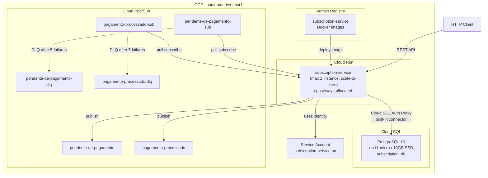
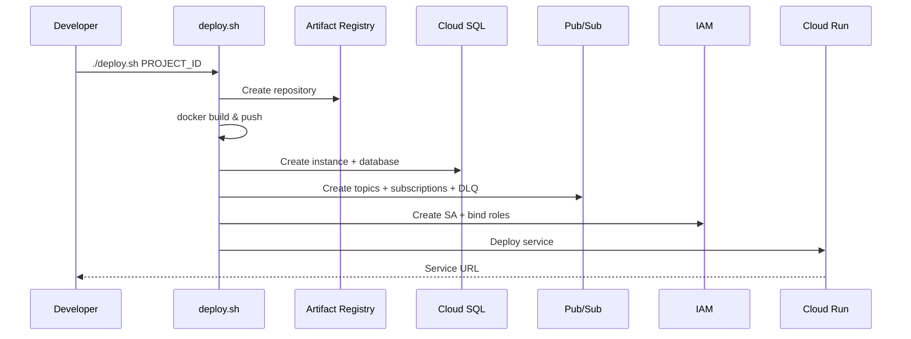
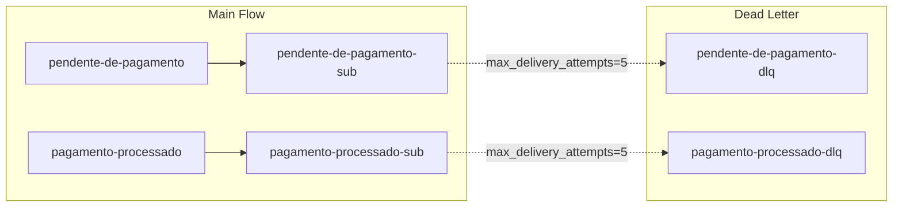

# Design Document: GCP Cloud Deployment

## Overview

This design describes the infrastructure and configuration artifacts needed to deploy the subscription-service Spring Boot application to Google Cloud Platform. The deployment targets a minimal-cost, demo-grade setup using Cloud Run (serverless containers), Cloud SQL PostgreSQL (managed database), and Cloud Pub/Sub (managed messaging). All provisioning is performed by a single idempotent shell script using the gcloud CLI — no Terraform or IaC frameworks are involved.

### Key Design Decisions

| Decision | Choice | Rationale |
|----------|--------|-----------|
| Compute | Cloud Run | Pay-per-use, scale-to-zero, no cluster management |
| Database connectivity | Cloud SQL public IP + Cloud Run built-in connector | No VPC connector costs, simpler for demo |
| Image registry | Artifact Registry | Native GCP integration with Cloud Run |
| Provisioning tool | gcloud CLI script | Simpler than Terraform for a single-environment demo |
| Access control | Unauthenticated | Demo purposes only |
| Region | southamerica-east1 | São Paulo, lowest latency for demonstration |

## Architecture



### Deployment Flow



## Components and Interfaces

### 1. Dockerfile (Multi-Stage Build)

The Dockerfile uses two stages to produce a minimal runtime image:

```dockerfile
# Stage 1: Build
FROM eclipse-temurin:25-jdk AS builder
WORKDIR /app
COPY pom.xml mvnw ./
COPY .mvn .mvn
RUN ./mvnw dependency:go-offline -B
COPY src ./src
RUN ./mvnw package -DskipTests -B

# Stage 2: Runtime
FROM eclipse-temurin:25-jre
WORKDIR /app
COPY --from=builder /app/target/subscription-service-*.jar app.jar
EXPOSE 8080
ENTRYPOINT ["java", "-jar", "app.jar", "--spring.profiles.active=cloud"]
```

**Design notes:**
- `dependency:go-offline` in the build stage enables Docker layer caching for dependencies
- Only the JAR artifact is copied to the runtime stage (~50MB reduction)
- The `cloud` profile is activated via the ENTRYPOINT command-line argument

### 2. Application Cloud Profile (`application-cloud.yml`)

A separate profile file keeps cloud configuration isolated from local development:

```yaml
spring:
  config:
    activate:
      on-profile: cloud
  datasource:
    url: jdbc:postgresql:///${DB_NAME}?cloudSqlInstance=${CLOUD_SQL_INSTANCE}&socketFactory=com.google.cloud.sql.postgres.SocketFactory
    username: ${DB_USER}
    password: ${DB_PASSWORD}
    driver-class-name: org.postgresql.Driver
  jpa:
    hibernate:
      ddl-auto: none
    show-sql: false
    properties:
      hibernate:
        dialect: org.hibernate.dialect.PostgreSQLDialect
  liquibase:
    change-log: classpath:db/changelog/db.changelog-master.yaml
    enabled: true
  cloud:
    gcp:
      project-id: ${GCP_PROJECT_ID}
      credentials:
        enabled: true
```

**Key differences from local profile:**
- Datasource uses Cloud SQL JDBC Socket Factory (no IP/port needed)
- All credentials sourced from environment variables
- GCP credentials enabled (uses service account identity)
- Pub/Sub emulator host is NOT set → real Pub/Sub used automatically

### 3. Deployment Script (`deploy.sh`)

Structure and responsibilities:

```
deploy.sh <PROJECT_ID>
├── Validate prerequisites (gcloud, docker, jq)
├── Set variables (region, instance names, SA email)
├── Enable required APIs
│   ├── run.googleapis.com
│   ├── sqladmin.googleapis.com
│   ├── pubsub.googleapis.com
│   └── artifactregistry.googleapis.com
├── Create Artifact Registry repository
├── Build and push Docker image
├── Provision Cloud SQL
│   ├── Create instance (db-f1-micro, 10GB SSD, public IP)
│   ├── Set root password
│   ├── Create database "subscription_db"
│   └── Create application user
├── Provision Pub/Sub
│   ├── Create 4 topics
│   ├── Create 2 subscriptions with DLQ routing
│   └── Grant Pub/Sub publisher role to SA on DLQ topics
├── Create Service Account + IAM bindings
│   ├── roles/cloudsql.client
│   ├── roles/pubsub.publisher
│   └── roles/pubsub.subscriber
├── Deploy Cloud Run service
│   ├── --image from Artifact Registry
│   ├── --set-env-vars (DB_*, GCP_PROJECT_ID, CLOUD_SQL_INSTANCE)
│   ├── --add-cloudsql-instances (built-in connector)
│   ├── --service-account
│   ├── --max-instances=1, --min-instances=0
│   ├── --memory=512Mi, --cpu=1
│   ├── --no-cpu-throttling (cpu-always-allocated)
│   ├── --timeout=300
│   └── --allow-unauthenticated
└── Output service URL
```

**Idempotency strategy:**
- Each `gcloud` create command uses `--quiet` and checks for existing resources with `gcloud describe` before creating
- `docker push` is naturally idempotent (same tag = overwrite)
- IAM bindings use `add-iam-policy-binding` which is additive and safe to repeat

### 4. Teardown Script (`teardown.sh`)

```
teardown.sh <PROJECT_ID>
├── Delete Cloud Run service
├── Delete Cloud SQL instance (--quiet, skips prompt)
├── Delete Pub/Sub subscriptions
├── Delete Pub/Sub topics
├── Delete Artifact Registry repository (--quiet)
├── Delete Service Account
└── Output confirmation
```

### 5. Service Account and IAM

| Role | Purpose |
|------|---------|
| `roles/cloudsql.client` | Allows Cloud SQL Auth Proxy connection |
| `roles/pubsub.publisher` | Allows publishing to Pub/Sub topics |
| `roles/pubsub.subscriber` | Allows subscribing/pulling from Pub/Sub |

The service account `subscription-service-sa@PROJECT_ID.iam.gserviceaccount.com` is bound to the Cloud Run service at deploy time.

### 6. Pub/Sub Configuration with DLQ



Subscription creation with DLQ:
```bash
gcloud pubsub subscriptions create pendente-de-pagamento-sub \
  --topic=pendente-de-pagamento \
  --dead-letter-topic=pendente-de-pagamento-dlq \
  --max-delivery-attempts=5 \
  --ack-deadline=60
```

### 7. Cloud Run Service Configuration

| Parameter | Value | Rationale |
|-----------|-------|-----------|
| `--max-instances` | 1 | Single instance demo |
| `--min-instances` | 0 | Scale-to-zero for cost |
| `--memory` | 512Mi | Sufficient for Spring Boot + JPA |
| `--cpu` | 1 | Single vCPU |
| `--no-cpu-throttling` | enabled | Keeps CPU allocated for scheduler cron |
| `--timeout` | 300 | 5 min for long requests |
| `--port` | 8080 | Spring Boot default |
| `--allow-unauthenticated` | yes | Demo access |
| `--add-cloudsql-instances` | PROJECT:REGION:INSTANCE | Built-in Cloud SQL connector |

### 8. Environment Variables Mapping

| Env Var | Source | Used By |
|---------|--------|---------|
| `GCP_PROJECT_ID` | Script parameter | Spring Cloud GCP |
| `CLOUD_SQL_INSTANCE` | `PROJECT:southamerica-east1:subscription-db` | JDBC Socket Factory |
| `DB_NAME` | `subscription_db` | Datasource URL |
| `DB_USER` | Created during provisioning | Datasource |
| `DB_PASSWORD` | Generated/provided | Datasource |
| `SPRING_PROFILES_ACTIVE` | `cloud` | Profile activation |

## Data Models

This feature does not introduce new domain data models. The existing schema (users, plans, subscriptions, payments, events) is deployed as-is to Cloud SQL via Liquibase migrations.

### Infrastructure Resource Naming

| Resource | Name | Location |
|----------|------|----------|
| Cloud SQL instance | `subscription-db` | southamerica-east1 |
| Cloud SQL database | `subscription_db` | on instance |
| Artifact Registry repo | `subscription-service` | southamerica-east1 |
| Cloud Run service | `subscription-service` | southamerica-east1 |
| Service Account | `subscription-service-sa` | project-level |
| Pub/Sub topics | `pendente-de-pagamento`, `pagamento-processado`, `*-dlq` | project-level |
| Pub/Sub subscriptions | `pendente-de-pagamento-sub`, `pagamento-processado-sub` | project-level |

## Error Handling

### Deployment Script Errors

- **`set -euo pipefail`**: The script halts on any command failure
- Each step prints a descriptive status message before executing
- On failure, the partial state is left in place (user can re-run or teardown)
- API enablement is checked first to surface permission issues early

### Application Startup Errors

| Scenario | Behavior |
|----------|----------|
| Cloud SQL unreachable | Spring Boot fails to start, logs connection error |
| Liquibase migration failure | Application context fails, error in Cloud Run logs |
| Pub/Sub permission denied | PubSubInitializer logs warning, app starts but messaging fails |
| Invalid environment variables | DataSource creation fails, app won't start |

### Cloud Run Runtime Errors

- Cloud Run automatically restarts failed containers (up to backoff limit)
- Unhealthy instances (failing health checks) are replaced
- Request timeouts (300s) return 504 to the caller

## Correctness Properties

This feature is an infrastructure deployment (shell scripts, YAML configuration, Dockerfile). There are no pure functions or input/output transformations suitable for property-based testing. The correctness guarantees are validated through deployment smoke tests and integration checklists.

### Property 1: Deployment script idempotency

*For any* valid GCP project ID, running `deploy.sh` twice in sequence SHALL produce the same final infrastructure state as running it once, without errors on the second execution.

**Validates: Requirements 8.3**

### Property 2: Scale-to-zero cost invariant

*For any* idle period exceeding the Cloud Run scale-down threshold, the number of active Cloud Run instances SHALL be zero, incurring zero compute cost.

**Validates: Requirements 10.1, 3.2**

### Property 3: Teardown completeness

*For any* successful deployment, running `teardown.sh` SHALL result in all provisioned resources (Cloud Run, Cloud SQL, Pub/Sub, Artifact Registry, Service Account) returning NOT_FOUND when queried via gcloud CLI.

**Validates: Requirements 10.5**

## Testing Strategy

### Why Property-Based Testing Does NOT Apply

This feature is **Infrastructure as Code / deployment scripting**. It consists of:
- Shell scripts executing `gcloud` CLI commands (side-effect-only operations)
- YAML configuration files (declarative, no logic)
- A Dockerfile (build instructions, no transformable input/output)

There are no pure functions, no input/output transformations, and no universal properties that hold across a range of inputs. PBT is not appropriate here.

### Applicable Testing Approaches

#### 1. Manual Smoke Tests (Primary)

After deployment, verify:
- [ ] Cloud Run service responds at the output URL (`/actuator/health`)
- [ ] Database schema is applied (check Liquibase `DATABASECHANGELOG` table)
- [ ] Pub/Sub topics exist (`gcloud pubsub topics list`)
- [ ] Subscription create → payment flow works end-to-end
- [ ] Teardown script removes all resources

#### 2. Script Validation (Pre-deployment)

- **shellcheck**: Lint both `deploy.sh` and `teardown.sh` for shell scripting errors
- **Dry-run verification**: Confirm all `gcloud` commands have correct syntax (manually or via `--dry-run` where supported)

#### 3. Configuration Validation

- Verify `application-cloud.yml` loads correctly with Spring Boot profile activation
- Verify Dockerfile builds successfully: `docker build -t test .`
- Verify the Maven build produces the expected JAR artifact

#### 4. Integration Test Checklist

| Test | Method | Pass Criteria |
|------|--------|---------------|
| Image builds | `docker build .` | Exit code 0 |
| App starts with cloud profile (mocked DB) | Local run with env vars | Health endpoint responds |
| Deploy script is idempotent | Run twice | Second run completes without errors |
| Teardown removes resources | Run teardown | `gcloud` describe commands return NOT_FOUND |
| Liquibase migrations run | Check Cloud SQL after deploy | All changelogs applied |
| Pub/Sub DLQ routing | Publish + nack 5 times | Message appears in DLQ topic |

#### 5. Cost Verification

- After 24h idle, verify Cloud Run has 0 billable instance-hours
- Confirm Cloud SQL is the sole ongoing cost (~$7-9/month for db-f1-micro)
