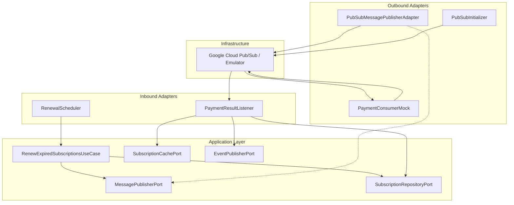
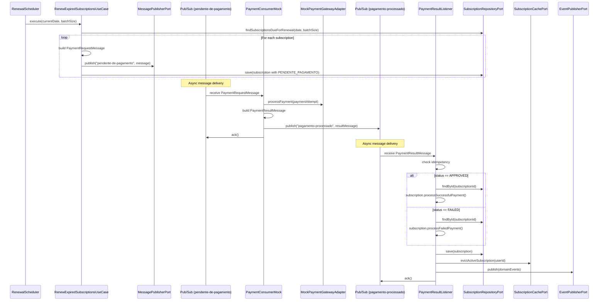

# Design Document

## Overview

Este design descreve a refatoração do fluxo de renovação de assinaturas para usar Google Cloud Pub/Sub como camada de mensageria assíncrona. O objetivo é desacoplar o processamento de pagamento da execução do batch de renovação, substituindo a chamada síncrona ao `PaymentGatewayPort` por publicação de mensagens em tópicos Pub/Sub.

### Fluxo Atual (Síncrono)

```
RenewalScheduler → RenewExpiredSubscriptionsUseCase → PaymentGatewayPort.processPayment() → update Subscription
```

### Fluxo Novo (Assíncrono via Pub/Sub)

```
RenewalScheduler → RenewExpiredSubscriptionsUseCase → publish to "pendente-de-pagamento"
                                                        ↓
Payment_Consumer_Mock (subscriber) → processPayment → publish to "pagamento-processado"
                                                        ↓
Payment_Result_Listener (subscriber) → update Subscription state
```

### Design Principles

1. **Hexagonal Integrity**: Novos ports (`MessagePublisherPort`) e adapters Pub/Sub sem acoplar o domain/application a infraestrutura
2. **Local-First**: Pub/Sub emulator via Docker — zero dependência de GCP credentials em dev
3. **Resilience**: Retry com exponential backoff na publicação, DLQ para mensagens problemáticas
4. **Idempotency**: Chave de idempotência previne processamento duplicado
5. **Observability**: Métricas e logs estruturados em cada etapa do fluxo

### Decisões Técnicas

| Decisão | Escolha | Justificativa |
|---------|---------|---------------|
| Library Pub/Sub | `spring-cloud-gcp-starter-pubsub` 6.5.x | Integração nativa com Spring Boot 3.x, suporte a emulador via `PUBSUB_EMULATOR_HOST` |
| Emulator | `gcr.io/google.com/cloudsdktool/google-cloud-cli` com entrypoint `gcloud beta emulators pubsub start` | Imagem oficial Google, consistente com SDK |
| Serialização | Jackson JSON (já presente no projeto) | Reutiliza ObjectMapper existente, interoperável |
| Retry na publicação | Spring Retry (`@Retryable`) com exponential backoff | Simples, configurável, sem nova dependência |
| Mock Consumer | Spring `@Component` no mesmo app (profile local) | Simplicidade para dev local, sem app separado |
| Topic init | `@PostConstruct` bean com `PubSubAdmin` | Criação automática de topics/subscriptions na inicialização |

## Architecture

### Package Structure (Novas adições)

```
src/main/java/com/globo/subscription/
├── application/
│   ├── port/
│   │   ├── MessagePublisherPort.java          ← NOVO
│   │   └── ... (ports existentes)
│   └── usecase/
│       └── RenewExpiredSubscriptionsUseCase.java  ← REFATORADO
├── adapter/
│   ├── inbound/
│   │   ├── messaging/
│   │   │   └── PaymentResultListener.java     ← NOVO
│   │   └── scheduler/
│   │       └── RenewalScheduler.java          (sem alterações)
│   └── outbound/
│       ├── messaging/
│       │   ├── PubSubMessagePublisherAdapter.java  ← NOVO
│       │   ├── PaymentConsumerMock.java            ← NOVO
│       │   └── PubSubInitializer.java              ← NOVO
│       └── payment/
│           └── MockPaymentGatewayAdapter.java     (mantido para uso do consumer mock)
├── adapter/
│   └── config/
│       └── PubSubConfig.java                  ← NOVO
└── application/
    └── dto/
        ├── PaymentRequestMessage.java         ← NOVO
        └── PaymentResultMessage.java          ← NOVO
```

### Dependency Flow — Messaging Components



### Sequence Diagram — Renewal Flow (Novo)



## Components and Interfaces

### Novos Port Interfaces

#### MessagePublisherPort

```java
package com.globo.subscription.application.port;

/**
 * Port interface for publishing messages to a messaging system.
 * Decouples the application layer from specific messaging infrastructure (Pub/Sub, Kafka, etc.).
 */
public interface MessagePublisherPort {

    /**
     * Publishes a message payload to the specified topic.
     *
     * @param topic   the topic identifier to publish to
     * @param payload the message object to be serialized and published
     * @throws MessagePublishException if publication fails after retries
     */
    void publish(String topic, Object payload);
}
```

### Novos DTOs de Mensagem

#### PaymentRequestMessage

```java
package com.globo.subscription.application.dto;

import java.math.BigDecimal;
import java.time.Instant;
import java.util.UUID;

/**
 * Message published to the "pendente-de-pagamento" topic.
 * Contains all data needed for payment processing.
 */
public record PaymentRequestMessage(
    UUID messageId,
    UUID subscriptionId,
    UUID userId,
    UUID planId,
    BigDecimal amount,
    String currency,
    int attemptNumber,
    String idempotencyKey,
    Instant timestamp
) {
    public PaymentRequestMessage {
        if (subscriptionId == null) throw new IllegalArgumentException("subscriptionId must not be null");
        if (userId == null) throw new IllegalArgumentException("userId must not be null");
        if (planId == null) throw new IllegalArgumentException("planId must not be null");
        if (amount == null) throw new IllegalArgumentException("amount must not be null");
        if (currency == null || currency.isBlank()) throw new IllegalArgumentException("currency must not be blank");
        if (idempotencyKey == null || idempotencyKey.isBlank()) throw new IllegalArgumentException("idempotencyKey must not be blank");
        if (messageId == null) throw new IllegalArgumentException("messageId must not be null");
        if (timestamp == null) throw new IllegalArgumentException("timestamp must not be null");
    }
}
```

#### PaymentResultMessage

```java
package com.globo.subscription.application.dto;

import java.time.Instant;
import java.util.UUID;

/**
 * Message published to the "pagamento-processado" topic.
 * Contains the result of payment processing.
 */
public record PaymentResultMessage(
    UUID subscriptionId,
    UUID userId,
    PaymentStatus status,
    String providerTransactionId,   // non-null when APPROVED
    String errorCode,               // non-null when FAILED
    String errorMessage,            // non-null when FAILED
    String idempotencyKey,
    Instant processedAt
) {
    public enum PaymentStatus {
        APPROVED, FAILED
    }

    public PaymentResultMessage {
        if (subscriptionId == null) throw new IllegalArgumentException("subscriptionId must not be null");
        if (userId == null) throw new IllegalArgumentException("userId must not be null");
        if (status == null) throw new IllegalArgumentException("status must not be null");
        if (idempotencyKey == null || idempotencyKey.isBlank()) throw new IllegalArgumentException("idempotencyKey must not be blank");
        if (processedAt == null) throw new IllegalArgumentException("processedAt must not be null");
    }
}
```

### Novos Adapter Implementations

#### PubSubMessagePublisherAdapter (Outbound)

```java
package com.globo.subscription.adapter.outbound.messaging;

import com.fasterxml.jackson.databind.ObjectMapper;
import com.globo.subscription.application.port.MessagePublisherPort;
import com.google.cloud.spring.pubsub.core.PubSubTemplate;
import org.slf4j.Logger;
import org.slf4j.LoggerFactory;
import org.springframework.retry.annotation.Backoff;
import org.springframework.retry.annotation.Retryable;
import org.springframework.stereotype.Component;
import io.micrometer.core.instrument.Counter;
import io.micrometer.core.instrument.MeterRegistry;

/**
 * Pub/Sub implementation of MessagePublisherPort.
 * Serializes payloads to JSON and publishes via PubSubTemplate.
 * Retries with exponential backoff on failure.
 */
@Component
public class PubSubMessagePublisherAdapter implements MessagePublisherPort {

    private static final Logger log = LoggerFactory.getLogger(PubSubMessagePublisherAdapter.class);

    private final PubSubTemplate pubSubTemplate;
    private final ObjectMapper objectMapper;
    private final Counter publishSuccessCounter;
    private final Counter publishFailureCounter;

    public PubSubMessagePublisherAdapter(PubSubTemplate pubSubTemplate,
                                          ObjectMapper objectMapper,
                                          MeterRegistry meterRegistry) {
        this.pubSubTemplate = pubSubTemplate;
        this.objectMapper = objectMapper;
        this.publishSuccessCounter = Counter.builder("pubsub.message.published")
                .tag("outcome", "success")
                .register(meterRegistry);
        this.publishFailureCounter = Counter.builder("pubsub.message.published")
                .tag("outcome", "failure")
                .register(meterRegistry);
    }

    @Override
    @Retryable(maxAttempts = 3, backoff = @Backoff(delay = 1000, multiplier = 2))
    public void publish(String topic, Object payload) {
        try {
            String json = objectMapper.writeValueAsString(payload);
            pubSubTemplate.publish(topic, json).get();
            publishSuccessCounter.increment();
            log.info("Message published to topic '{}' successfully", topic);
        } catch (Exception e) {
            publishFailureCounter.increment();
            log.error("Failed to publish message to topic '{}': {}", topic, e.getMessage());
            throw new RuntimeException("Failed to publish message to topic: " + topic, e);
        }
    }
}
```

#### PaymentConsumerMock (Outbound — simulates external payment service)

```java
package com.globo.subscription.adapter.outbound.messaging;

import com.fasterxml.jackson.databind.ObjectMapper;
import com.globo.subscription.application.dto.PaymentRequestMessage;
import com.globo.subscription.application.dto.PaymentResultMessage;
import com.globo.subscription.application.port.PaymentGatewayPort;
import com.globo.subscription.application.port.PaymentResult;
import com.globo.subscription.domain.entity.PaymentAttempt;
import com.globo.subscription.domain.enums.PaymentAttemptStatus;
import com.globo.subscription.domain.vo.Money;
import com.google.cloud.spring.pubsub.core.PubSubTemplate;
import com.google.cloud.spring.pubsub.support.BasicAcknowledgeablePubsubMessage;
import org.slf4j.Logger;
import org.slf4j.LoggerFactory;
import org.springframework.beans.factory.annotation.Value;
import org.springframework.stereotype.Component;

import jakarta.annotation.PostConstruct;
import java.time.Instant;
import java.util.UUID;

/**
 * Mock payment consumer that subscribes to "pendente-de-pagamento",
 * simulates payment processing, and publishes result to "pagamento-processado".
 * Runs as a Spring component within the same application for local development.
 */
@Component
public class PaymentConsumerMock {

    private static final Logger log = LoggerFactory.getLogger(PaymentConsumerMock.class);

    private final PubSubTemplate pubSubTemplate;
    private final ObjectMapper objectMapper;
    private final PaymentGatewayPort paymentGatewayPort;
    private final String pendingSubscription;
    private final String processedTopic;

    public PaymentConsumerMock(PubSubTemplate pubSubTemplate,
                               ObjectMapper objectMapper,
                               PaymentGatewayPort paymentGatewayPort,
                               @Value("${pubsub.subscription.pendente-pagamento}") String pendingSubscription,
                               @Value("${pubsub.topic.pagamento-processado}") String processedTopic) {
        this.pubSubTemplate = pubSubTemplate;
        this.objectMapper = objectMapper;
        this.paymentGatewayPort = paymentGatewayPort;
        this.pendingSubscription = pendingSubscription;
        this.processedTopic = processedTopic;
    }

    @PostConstruct
    public void startListening() {
        pubSubTemplate.subscribe(pendingSubscription, this::handleMessage);
        log.info("PaymentConsumerMock subscribed to '{}'", pendingSubscription);
    }

    private void handleMessage(BasicAcknowledgeablePubsubMessage message) {
        try {
            String payload = message.getPubsubMessage().getData().toStringUtf8();
            PaymentRequestMessage request = objectMapper.readValue(payload, PaymentRequestMessage.class);

            log.info("Processing payment for subscription {} with idempotencyKey {}",
                    request.subscriptionId(), request.idempotencyKey());

            // Build PaymentAttempt for the gateway
            PaymentAttempt attempt = new PaymentAttempt(
                    UUID.randomUUID(), request.subscriptionId(),
                    new Money(request.amount(), request.currency()),
                    PaymentAttemptStatus.PROCESSING, request.attemptNumber(),
                    request.idempotencyKey(), null, null, null, Instant.now(), null
            );

            PaymentResult result = paymentGatewayPort.processPayment(attempt);

            PaymentResultMessage resultMessage = buildResultMessage(request, result);
            String resultJson = objectMapper.writeValueAsString(resultMessage);
            pubSubTemplate.publish(processedTopic, resultJson).get();

            message.ack();
            log.info("Payment result published for subscription {}: {}",
                    request.subscriptionId(), resultMessage.status());
        } catch (Exception e) {
            log.error("Failed to process payment message: {}", e.getMessage(), e);
            message.nack();
        }
    }

    private PaymentResultMessage buildResultMessage(PaymentRequestMessage request, PaymentResult result) {
        return switch (result) {
            case PaymentResult.Approved approved -> new PaymentResultMessage(
                    request.subscriptionId(), request.userId(),
                    PaymentResultMessage.PaymentStatus.APPROVED,
                    approved.providerTransactionId(), null, null,
                    request.idempotencyKey(), Instant.now()
            );
            case PaymentResult.Failed failed -> new PaymentResultMessage(
                    request.subscriptionId(), request.userId(),
                    PaymentResultMessage.PaymentStatus.FAILED,
                    null, failed.errorCode(), failed.errorMessage(),
                    request.idempotencyKey(), Instant.now()
            );
        };
    }
}
```

#### PaymentResultListener (Inbound — subscription service consumes results)

```java
package com.globo.subscription.adapter.inbound.messaging;

import com.fasterxml.jackson.databind.ObjectMapper;
import com.globo.subscription.application.dto.PaymentResultMessage;
import com.globo.subscription.application.port.EventPublisherPort;
import com.globo.subscription.application.port.SubscriptionCachePort;
import com.globo.subscription.application.port.SubscriptionRepositoryPort;
import com.globo.subscription.domain.entity.Subscription;
import com.globo.subscription.domain.event.DomainEvent;
import com.google.cloud.spring.pubsub.core.PubSubTemplate;
import com.google.cloud.spring.pubsub.support.BasicAcknowledgeablePubsubMessage;
import io.micrometer.core.instrument.Counter;
import io.micrometer.core.instrument.MeterRegistry;
import io.micrometer.core.instrument.Timer;
import org.slf4j.Logger;
import org.slf4j.LoggerFactory;
import org.slf4j.MDC;
import org.springframework.beans.factory.annotation.Value;
import org.springframework.stereotype.Component;
import org.springframework.transaction.annotation.Transactional;

import jakarta.annotation.PostConstruct;
import java.util.Optional;
import java.util.Set;
import java.util.concurrent.ConcurrentHashMap;

/**
 * Inbound adapter that listens to "pagamento-processado" topic
 * and updates subscription state based on payment results.
 * Processes messages idempotently using the idempotencyKey.
 */
@Component
public class PaymentResultListener {

    private static final Logger log = LoggerFactory.getLogger(PaymentResultListener.class);

    private final PubSubTemplate pubSubTemplate;
    private final ObjectMapper objectMapper;
    private final SubscriptionRepositoryPort subscriptionRepositoryPort;
    private final SubscriptionCachePort subscriptionCachePort;
    private final EventPublisherPort eventPublisherPort;
    private final String processedSubscription;
    private final Counter approvedCounter;
    private final Counter failedCounter;
    private final Counter errorCounter;
    private final Timer processingTimer;
    private final Set<String> processedKeys = ConcurrentHashMap.newKeySet();

    public PaymentResultListener(PubSubTemplate pubSubTemplate,
                                  ObjectMapper objectMapper,
                                  SubscriptionRepositoryPort subscriptionRepositoryPort,
                                  SubscriptionCachePort subscriptionCachePort,
                                  EventPublisherPort eventPublisherPort,
                                  @Value("${pubsub.subscription.pagamento-processado}") String processedSubscription,
                                  MeterRegistry meterRegistry) {
        this.pubSubTemplate = pubSubTemplate;
        this.objectMapper = objectMapper;
        this.subscriptionRepositoryPort = subscriptionRepositoryPort;
        this.subscriptionCachePort = subscriptionCachePort;
        this.eventPublisherPort = eventPublisherPort;
        this.processedSubscription = processedSubscription;
        this.approvedCounter = Counter.builder("pubsub.message.consumed")
                .tag("outcome", "approved").register(meterRegistry);
        this.failedCounter = Counter.builder("pubsub.message.consumed")
                .tag("outcome", "failed").register(meterRegistry);
        this.errorCounter = Counter.builder("pubsub.message.consumed")
                .tag("outcome", "error").register(meterRegistry);
        this.processingTimer = Timer.builder("pubsub.message.processing.duration")
                .register(meterRegistry);
    }

    @PostConstruct
    public void startListening() {
        pubSubTemplate.subscribe(processedSubscription, this::handleMessage);
        log.info("PaymentResultListener subscribed to '{}'", processedSubscription);
    }

    private void handleMessage(BasicAcknowledgeablePubsubMessage message) {
        Timer.Sample sample = Timer.start();
        try {
            String payload = message.getPubsubMessage().getData().toStringUtf8();
            PaymentResultMessage resultMessage = objectMapper.readValue(payload, PaymentResultMessage.class);

            MDC.put("subscriptionId", resultMessage.subscriptionId().toString());
            MDC.put("idempotencyKey", resultMessage.idempotencyKey());

            // Idempotency check
            if (processedKeys.contains(resultMessage.idempotencyKey())) {
                log.info("Duplicate message detected for idempotencyKey '{}'. Skipping.", resultMessage.idempotencyKey());
                message.ack();
                return;
            }

            processPaymentResult(resultMessage);
            processedKeys.add(resultMessage.idempotencyKey());
            message.ack();
        } catch (com.fasterxml.jackson.core.JsonProcessingException e) {
            log.error("Failed to deserialize payment result message: {}", e.getMessage());
            errorCounter.increment();
            message.ack(); // Don't retry malformed messages
        } catch (Exception e) {
            log.error("Error processing payment result: {}", e.getMessage(), e);
            errorCounter.increment();
            message.nack(); // Retry via Pub/Sub
        } finally {
            sample.stop(processingTimer);
            MDC.clear();
        }
    }

    @Transactional
    protected void processPaymentResult(PaymentResultMessage resultMessage) {
        Optional<Subscription> optSubscription = subscriptionRepositoryPort
                .findById(resultMessage.subscriptionId());

        if (optSubscription.isEmpty()) {
            log.warn("Subscription {} not found. Acknowledging message without processing.",
                    resultMessage.subscriptionId());
            return;
        }

        Subscription subscription = optSubscription.get();

        switch (resultMessage.status()) {
            case APPROVED -> {
                subscription.processSuccessfulPayment();
                approvedCounter.increment();
            }
            case FAILED -> {
                subscription.processFailedPayment();
                failedCounter.increment();
            }
        }

        subscriptionRepositoryPort.save(subscription);
        subscriptionCachePort.evictActiveSubscription(subscription.getUserId());

        for (DomainEvent event : subscription.getDomainEvents()) {
            eventPublisherPort.publish(event);
        }
        subscription.clearDomainEvents();
    }
}
```

#### PubSubInitializer (Topic/Subscription auto-creation)

```java
package com.globo.subscription.adapter.outbound.messaging;

import com.google.cloud.spring.pubsub.PubSubAdmin;
import org.slf4j.Logger;
import org.slf4j.LoggerFactory;
import org.springframework.beans.factory.annotation.Value;
import org.springframework.stereotype.Component;

import jakarta.annotation.PostConstruct;

/**
 * Initializes Pub/Sub topics and subscriptions on application startup.
 * Creates topics and subscriptions if they don't already exist.
 * Intended for local development with the Pub/Sub emulator.
 */
@Component
public class PubSubInitializer {

    private static final Logger log = LoggerFactory.getLogger(PubSubInitializer.class);

    private final PubSubAdmin pubSubAdmin;
    private final String pendingTopic;
    private final String pendingSubscription;
    private final String processedTopic;
    private final String processedSubscription;
    private final String pendingDlqTopic;
    private final String processedDlqTopic;

    public PubSubInitializer(PubSubAdmin pubSubAdmin,
                              @Value("${pubsub.topic.pendente-pagamento}") String pendingTopic,
                              @Value("${pubsub.subscription.pendente-pagamento}") String pendingSubscription,
                              @Value("${pubsub.topic.pagamento-processado}") String processedTopic,
                              @Value("${pubsub.subscription.pagamento-processado}") String processedSubscription,
                              @Value("${pubsub.topic.pendente-pagamento-dlq}") String pendingDlqTopic,
                              @Value("${pubsub.topic.pagamento-processado-dlq}") String processedDlqTopic) {
        this.pubSubAdmin = pubSubAdmin;
        this.pendingTopic = pendingTopic;
        this.pendingSubscription = pendingSubscription;
        this.processedTopic = processedTopic;
        this.processedSubscription = processedSubscription;
        this.pendingDlqTopic = pendingDlqTopic;
        this.processedDlqTopic = processedDlqTopic;
    }

    @PostConstruct
    public void initializeTopicsAndSubscriptions() {
        createTopicIfNotExists(pendingTopic);
        createTopicIfNotExists(processedTopic);
        createTopicIfNotExists(pendingDlqTopic);
        createTopicIfNotExists(processedDlqTopic);
        createSubscriptionIfNotExists(pendingSubscription, pendingTopic);
        createSubscriptionIfNotExists(processedSubscription, processedTopic);
        log.info("Pub/Sub topics and subscriptions initialized successfully");
    }

    private void createTopicIfNotExists(String topicName) {
        try {
            if (pubSubAdmin.getTopic(topicName) == null) {
                pubSubAdmin.createTopic(topicName);
                log.info("Created topic: {}", topicName);
            }
        } catch (Exception e) {
            log.warn("Could not create topic '{}': {}", topicName, e.getMessage());
        }
    }

    private void createSubscriptionIfNotExists(String subscriptionName, String topicName) {
        try {
            if (pubSubAdmin.getSubscription(subscriptionName) == null) {
                pubSubAdmin.createSubscription(subscriptionName, topicName);
                log.info("Created subscription: {} -> {}", subscriptionName, topicName);
            }
        } catch (Exception e) {
            log.warn("Could not create subscription '{}': {}", subscriptionName, e.getMessage());
        }
    }
}
```

### Refatoração do RenewExpiredSubscriptionsUseCase

```java
// Key changes to RenewExpiredSubscriptionsUseCase:
// 1. Replace PaymentGatewayPort dependency with MessagePublisherPort
// 2. Publish PaymentRequestMessage instead of calling processPayment
// 3. Update status to PENDENTE_PAGAMENTO after successful publish

@Service
@Transactional
public class RenewExpiredSubscriptionsUseCase {

    private final SubscriptionRepositoryPort subscriptionRepositoryPort;
    private final MessagePublisherPort messagePublisherPort;  // ← replaces PaymentGatewayPort
    private final SubscriptionCachePort subscriptionCachePort;
    private final EventPublisherPort eventPublisherPort;
    private final LockManagerPort lockManagerPort;
    private final String pendingPaymentTopic;
    // ... metrics fields

    // processSubscriptionRenewal changes to:
    private void processSubscriptionRenewal(Subscription subscription) {
        String idempotencyKey = String.format("subscription:%s:billing-cycle:%s",
                subscription.getId(), subscription.getExpirationDate());

        PaymentRequestMessage message = new PaymentRequestMessage(
                UUID.randomUUID(),
                subscription.getId(),
                subscription.getUserId(),
                subscription.getPlanId(),
                subscription.getPriceAtPurchase().amount(),
                subscription.getPriceAtPurchase().currency(),
                subscription.getFailedAttempts() + 1,
                idempotencyKey,
                Instant.now()
        );

        messagePublisherPort.publish(pendingPaymentTopic, message);

        // Update status to PENDENTE_PAGAMENTO (state no longer changes synchronously)
        // Note: We need to add a method or direct status setter for this transition
        subscription.markAsPendingPayment();
        subscriptionRepositoryPort.save(subscription);
        subscriptionCachePort.evictActiveSubscription(subscription.getUserId());
    }
}
```

### Configuração — application.yml (adições)

```yaml
# Pub/Sub configuration
pubsub:
  topic:
    pendente-pagamento: pendente-de-pagamento
    pagamento-processado: pagamento-processado
    pendente-pagamento-dlq: pendente-de-pagamento-dlq
    pagamento-processado-dlq: pagamento-processado-dlq
  subscription:
    pendente-pagamento: pendente-de-pagamento-sub
    pagamento-processado: pagamento-processado-sub

spring:
  cloud:
    gcp:
      pubsub:
        emulator-host: ${PUBSUB_EMULATOR_HOST:localhost:8085}
        project-id: local-project
```

### Docker Compose — Pub/Sub Emulator

```yaml
  pubsub-emulator:
    image: gcr.io/google.com/cloudsdktool/google-cloud-cli:latest
    container_name: pubsub-emulator
    command: ["gcloud", "beta", "emulators", "pubsub", "start", "--host-port=0.0.0.0:8085"]
    ports:
      - "8085:8085"
    healthcheck:
      test: ["CMD", "curl", "-f", "http://localhost:8085"]
      interval: 5s
      timeout: 3s
      retries: 10
      start_period: 5s
```

### Adapter Implementation Summary

| Port / Pattern | Adapter | Technology |
|----------------|---------|-----------|
| MessagePublisherPort | PubSubMessagePublisherAdapter | Spring Cloud GCP Pub/Sub + Jackson |
| Consumer (inbound) | PaymentResultListener | PubSubTemplate.subscribe() |
| Mock payment service | PaymentConsumerMock | PubSubTemplate.subscribe() + MockPaymentGatewayAdapter |
| Topic init | PubSubInitializer | PubSubAdmin |

## Data Models

### Mensagens (Records — Application DTO layer)

#### PaymentRequestMessage

| Campo | Tipo | Obrigatório | Descrição |
|-------|------|-------------|-----------|
| messageId | UUID | Sim | Identificador único da mensagem |
| subscriptionId | UUID | Sim | ID da assinatura |
| userId | UUID | Sim | ID do usuário |
| planId | UUID | Sim | ID do plano |
| amount | BigDecimal | Sim | Valor da cobrança |
| currency | String | Sim | Moeda (ex: "BRL") |
| attemptNumber | int | Sim | Número da tentativa (1-based) |
| idempotencyKey | String | Sim | Chave de idempotência para deduplicação |
| timestamp | Instant | Sim | Timestamp da publicação |

#### PaymentResultMessage

| Campo | Tipo | Obrigatório | Descrição |
|-------|------|-------------|-----------|
| subscriptionId | UUID | Sim | ID da assinatura processada |
| userId | UUID | Sim | ID do usuário |
| status | PaymentStatus | Sim | APPROVED ou FAILED |
| providerTransactionId | String | Condicional | ID da transação (quando APPROVED) |
| errorCode | String | Condicional | Código de erro (quando FAILED) |
| errorMessage | String | Condicional | Mensagem de erro (quando FAILED) |
| idempotencyKey | String | Sim | Chave de idempotência |
| processedAt | Instant | Sim | Timestamp do processamento |

### JSON Schema Examples

**PaymentRequestMessage:**
```json
{
  "messageId": "a1b2c3d4-5678-90ab-cdef-1234567890ab",
  "subscriptionId": "550e8400-e29b-41d4-a716-446655440000",
  "userId": "660e8400-e29b-41d4-a716-446655440001",
  "planId": "770e8400-e29b-41d4-a716-446655440002",
  "amount": 39.90,
  "currency": "BRL",
  "attemptNumber": 1,
  "idempotencyKey": "subscription:550e8400-e29b-41d4-a716-446655440000:billing-cycle:2025-02-15",
  "timestamp": "2025-01-15T10:30:00Z"
}
```

**PaymentResultMessage (APPROVED):**
```json
{
  "subscriptionId": "550e8400-e29b-41d4-a716-446655440000",
  "userId": "660e8400-e29b-41d4-a716-446655440001",
  "status": "APPROVED",
  "providerTransactionId": "txn-abc123",
  "errorCode": null,
  "errorMessage": null,
  "idempotencyKey": "subscription:550e8400-e29b-41d4-a716-446655440000:billing-cycle:2025-02-15",
  "processedAt": "2025-01-15T10:30:05Z"
}
```

### Alterações no Domain — Subscription

Nova transição de estado necessária:

```java
/**
 * Marks the subscription as pending payment after a payment request message is published.
 * Valid from ATIVA status only (first attempt) or PENDENTE_PAGAMENTO (retry).
 */
public void markAsPendingPayment() {
    rejectIfCancelada();
    if (this.status != SubscriptionStatus.ATIVA && this.status != SubscriptionStatus.PENDENTE_PAGAMENTO) {
        throw new IllegalStateException(
            "Cannot mark as pending payment from status: " + this.status);
    }
    this.status = SubscriptionStatus.PENDENTE_PAGAMENTO;
    this.updatedAt = Instant.now();
}
```

## Correctness Properties

*A property is a characteristic or behavior that should hold true across all valid executions of a system — essentially, a formal statement about what the system should do. Properties serve as the bridge between human-readable specifications and machine-verifiable correctness guarantees.*

### Property 1: PaymentRequestMessage construction correctness

*For any* valid Subscription entity eligible for renewal, constructing a PaymentRequestMessage SHALL produce a message where: (a) subscriptionId, userId, planId, amount, and currency match the source subscription fields; (b) attemptNumber equals failedAttempts + 1; (c) idempotencyKey follows the format `subscription:{subscriptionId}:billing-cycle:{expirationDate}`; (d) messageId is non-null and unique; (e) timestamp is non-null.

**Validates: Requirements 1.1, 1.2, 1.3**

### Property 2: PaymentRequestMessage serialization round-trip

*For any* valid PaymentRequestMessage object (with any combination of valid UUIDs, positive amounts, non-blank currencies, and valid timestamps), serializing to JSON and deserializing back SHALL produce an equivalent object with all fields preserved.

**Validates: Requirements 8.4**

### Property 3: PaymentResultMessage serialization round-trip

*For any* valid PaymentResultMessage object (both APPROVED and FAILED variants with their conditional fields), serializing to JSON and deserializing back SHALL produce an equivalent object with all fields preserved.

**Validates: Requirements 8.5**

### Property 4: Consumer mock produces valid PaymentResultMessage

*For any* valid PaymentRequestMessage consumed by the Payment_Consumer_Mock, the resulting PaymentResultMessage SHALL contain: (a) the same subscriptionId, userId, and idempotencyKey as the input; (b) a non-null status (APPROVED or FAILED); (c) a non-null processedAt timestamp; (d) providerTransactionId non-null when APPROVED; (e) errorCode non-null when FAILED.

**Validates: Requirements 2.2, 2.3**

### Property 5: Payment result listener routes correctly based on status

*For any* PaymentResultMessage with a valid subscriptionId that exists in the repository, the PaymentResultListener SHALL: (a) invoke processSuccessfulPayment when status is APPROVED; (b) invoke processFailedPayment when status is FAILED. In both cases, the resulting subscription state SHALL be consistent with the domain entity's state machine rules.

**Validates: Requirements 3.1, 3.2**

### Property 6: Payment result listener performs all side effects

*For any* successfully processed PaymentResultMessage (where the subscription exists), the PaymentResultListener SHALL: (a) persist the updated Subscription via the repository; (b) evict the cache for the subscription's userId; (c) publish all domain events registered on the entity.

**Validates: Requirements 3.3**

### Property 7: Idempotent message processing

*For any* PaymentResultMessage processed successfully, processing the same message a second time (same idempotencyKey) SHALL NOT modify the subscription state, SHALL NOT persist again, and SHALL acknowledge the message.

**Validates: Requirements 3.5**

### Property 8: Refactored use case publishes to queue and updates status

*For any* list of subscriptions eligible for renewal, executing RenewExpiredSubscriptionsUseCase SHALL: (a) publish exactly one PaymentRequestMessage per subscription to the pending topic; (b) update each subscription's status to PENDENTE_PAGAMENTO; (c) NOT invoke PaymentGatewayPort.processPayment.

**Validates: Requirements 6.1, 6.2, 6.3**

## Error Handling

### Publication Failures

| Scenario | Behavior | Recovery |
|----------|----------|----------|
| Pub/Sub temporarily unavailable | Retry 3x with exponential backoff (1s, 2s, 4s) | Automatic |
| All retries exhausted | Log error, skip subscription, continue batch | Manual investigation via logs |
| Serialization error | Throw immediately (programming bug) | Fix and redeploy |

### Consumption Failures

| Scenario | Behavior | Recovery |
|----------|----------|----------|
| Malformed JSON (deserialization fails) | Log error, ack message (no retry) | DLQ analysis |
| Subscription not found | Log warning, ack message | Data consistency check |
| Database error during persist | Nack message → Pub/Sub redelivers | Automatic via retry |
| Max delivery attempts exceeded (5) | Message moved to DLQ | Manual DLQ processing |
| Duplicate message (same idempotencyKey) | Log info, ack, skip processing | No action needed |

### Idempotency Strategy

- **Publisher side**: O `idempotencyKey` no formato `subscription:{id}:billing-cycle:{expirationDate}` garante que a mesma subscription não é cobrada duas vezes no mesmo ciclo
- **Consumer side (PaymentResultListener)**: Mantém um `Set<String>` de idempotencyKeys já processadas. Em produção, isso seria substituído por uma tabela de controle no banco
- **Pub/Sub level**: Messages are acked only after successful processing. Nack causes redelivery

### Exception Mapping

```java
// New exception for publish failures
public class MessagePublishException extends RuntimeException {
    private final String topic;
    private final String subscriptionId;
    // ...
}
```

O `RenewExpiredSubscriptionsUseCase` captura `MessagePublishException` por subscription individualmente, logando o erro e continuando o batch (mesmo padrão de resiliência do design anterior).

## Testing Strategy

### Test Pyramid

```
┌─────────────────────────────┐
│  Integration Tests          │  ← Pub/Sub emulator + Testcontainers
│  (PubSub round-trip flow)   │
├─────────────────────────────┤
│  Unit Tests (example-based) │  ← Mocks for ports, verify routing/logic
├─────────────────────────────┤
│  Property-Based Tests       │  ← jqwik: serialization, construction,
│  (100+ iterations each)     │     idempotency, routing
└─────────────────────────────┘
```

### Property-Based Testing Configuration

- **Library**: jqwik 1.9.2 (already in project)
- **Minimum iterations**: 100 per property
- **Tag format**: `Feature: payment-queue-decoupling, Property {N}: {description}`

Each property-based test SHALL:
1. Generate random valid inputs using jqwik `@Provide` arbitraries
2. Execute the operation under test
3. Assert the universal property holds
4. Be tagged with a comment referencing the design property number

### Test Categories

| Category | Scope | Technology |
|----------|-------|-----------|
| Property tests | Message serialization round-trips, construction invariants, idempotency, routing | jqwik |
| Unit tests | Publisher retry logic, listener error handling, DLQ warning logging, metric recording | JUnit 5 + Mockito |
| Integration tests | Full Pub/Sub flow with emulator (publish → consume → update), topic/subscription creation, DLQ behavior | Testcontainers + Pub/Sub emulator |

### Dependencies Adicionais (pom.xml)

```xml
<!-- Google Cloud Pub/Sub -->
<dependency>
    <groupId>com.google.cloud</groupId>
    <artifactId>spring-cloud-gcp-starter-pubsub</artifactId>
    <version>6.5.0</version>
</dependency>

<!-- Spring Retry (for @Retryable) -->
<dependency>
    <groupId>org.springframework.retry</groupId>
    <artifactId>spring-retry</artifactId>
</dependency>

<!-- Test: Testcontainers GCloud module (for Pub/Sub emulator in tests) -->
<dependency>
    <groupId>org.testcontainers</groupId>
    <artifactId>gcloud</artifactId>
    <version>${testcontainers.version}</version>
    <scope>test</scope>
</dependency>
```
