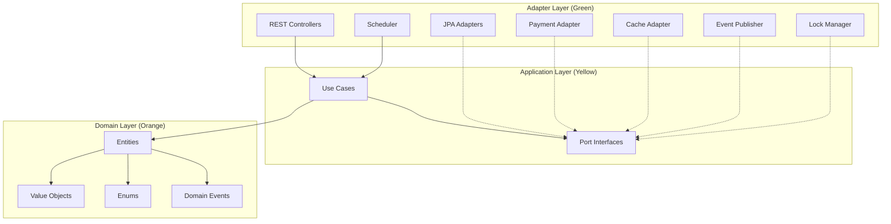
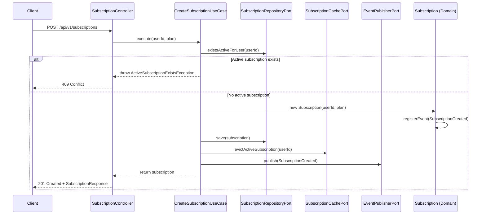
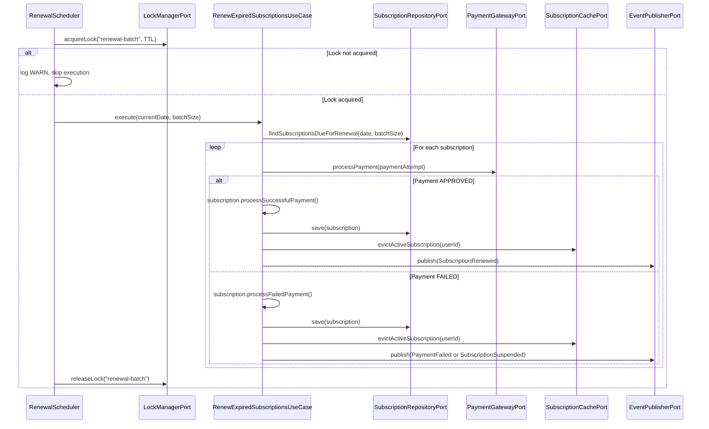

# Design Document

## Overview

Este design detalha a implementação em código do Sistema de Gestão de Assinaturas, seguindo a arquitetura hexagonal definida no spec de arquitetura. A implementação é 100% local-first (PostgreSQL local, Caffeine cache, mock payment gateway) e segue uma abordagem faseada onde cada fase é compilável e testável independentemente.

### Design Principles

1. **Hexagonal Purity**: Domain e Application layers sem dependências de framework/infraestrutura
2. **Local-First**: Tudo roda localmente com `docker compose up` + `./mvnw spring-boot:run`
3. **Phased Delivery**: Cada fase produz código compilável e testável
4. **Domain-Driven**: Regras de negócio encapsuladas em entities e value objects
5. **Port/Adapter Isolation**: Toda integração externa atrás de interfaces (ports)
6. **Test Pyramid**: Property-based tests no domain, unit tests nos use cases, integration tests com Testcontainers

### Implementation Phases

| Phase | Scope | Dependencies |
|-------|-------|-------------|
| 1 | Project scaffolding, build config, package structure | None |
| 2 | Domain layer (entities, VOs, enums, events) | Phase 1 |
| 3 | Application layer (use cases, ports) | Phase 2 |
| 4 | Persistence adapter (JPA, Liquibase, PostgreSQL) | Phase 3 |
| 5 | REST API adapter (controllers, DTOs, validation) | Phase 3 |
| 6 | Payment adapter (mock gateway, resilience4j) | Phase 3 |
| 7 | Scheduler, cache, event publisher | Phase 4, 6 |
| 8 | Observability, integration tests, documentation | Phase 7 |

## Architecture

### Hexagonal Architecture — Package Structure

```
src/main/java/com/globo/subscription/
├── domain/
│   ├── entity/
│   │   ├── User.java
│   │   ├── Subscription.java
│   │   ├── Plan.java
│   │   ├── PaymentMethod.java
│   │   └── PaymentAttempt.java
│   ├── vo/
│   │   └── Money.java
│   ├── enums/
│   │   ├── SubscriptionStatus.java
│   │   └── PaymentAttemptStatus.java
│   └── event/
│       ├── DomainEvent.java (sealed interface)
│       ├── SubscriptionCreated.java
│       ├── SubscriptionRenewed.java
│       ├── SubscriptionCanceled.java
│       ├── SubscriptionSuspended.java
│       ├── PaymentFailed.java
│       └── PaymentApproved.java
├── application/
│   ├── port/
│   │   ├── SubscriptionRepositoryPort.java
│   │   ├── UserRepositoryPort.java
│   │   ├── PlanRepositoryPort.java
│   │   ├── PaymentGatewayPort.java
│   │   ├── SubscriptionCachePort.java
│   │   ├── PlanCachePort.java
│   │   ├── EventPublisherPort.java
│   │   └── LockManagerPort.java
│   ├── usecase/
│   │   ├── CreateUserUseCase.java
│   │   ├── CreateSubscriptionUseCase.java
│   │   ├── RenewExpiredSubscriptionsUseCase.java
│   │   ├── CancelSubscriptionUseCase.java
│   │   └── GetActiveSubscriptionUseCase.java
│   └── exception/
│       ├── ActiveSubscriptionExistsException.java
│       ├── EmailAlreadyExistsException.java
│       ├── SubscriptionNotFoundException.java
│       └── InvalidStateTransitionException.java
├── adapter/
│   ├── inbound/
│   │   ├── rest/
│   │   │   ├── SubscriptionController.java
│   │   │   ├── UserController.java
│   │   │   ├── dto/
│   │   │   │   ├── CreateSubscriptionRequest.java
│   │   │   │   ├── CreateUserRequest.java
│   │   │   │   ├── SubscriptionResponse.java
│   │   │   │   ├── UserResponse.java
│   │   │   │   └── ErrorResponse.java
│   │   │   ├── mapper/
│   │   │   │   ├── SubscriptionRestMapper.java
│   │   │   │   └── UserRestMapper.java
│   │   │   └── GlobalExceptionHandler.java
│   │   └── scheduler/
│   │       └── RenewalScheduler.java
│   └── outbound/
│       ├── persistence/
│       │   ├── entity/
│       │   │   ├── SubscriptionJpaEntity.java
│       │   │   ├── UserJpaEntity.java
│       │   │   ├── PlanJpaEntity.java
│       │   │   ├── PaymentMethodJpaEntity.java
│       │   │   ├── PaymentAttemptJpaEntity.java
│       │   │   └── SubscriptionEventJpaEntity.java
│       │   ├── repository/
│       │   │   ├── SubscriptionJpaRepository.java (Spring Data)
│       │   │   ├── UserJpaRepository.java (Spring Data)
│       │   │   └── PlanJpaRepository.java (Spring Data)
│       │   ├── mapper/
│       │   │   ├── SubscriptionPersistenceMapper.java
│       │   │   ├── UserPersistenceMapper.java
│       │   │   └── PlanPersistenceMapper.java
│       │   ├── JpaSubscriptionRepositoryAdapter.java
│       │   ├── JpaUserRepositoryAdapter.java
│       │   └── JpaPlanRepositoryAdapter.java
│       ├── payment/
│       │   └── MockPaymentGatewayAdapter.java
│       ├── cache/
│       │   ├── CaffeineSubscriptionCacheAdapter.java
│       │   └── CaffeinePlanCacheAdapter.java
│       ├── event/
│       │   └── LocalEventPublisherAdapter.java
│       └── lock/
│           └── InMemoryLockManagerAdapter.java
└── SubscriptionServiceApplication.java
```

### Dependency Flow (Hexagonal Rule)



**Dependency rules:**
- Inbound adapters → Application (use cases)
- Use cases → Ports (interfaces) + Domain (entities)
- Outbound adapters implement Ports (dashed = realization)
- Domain has ZERO external dependencies (no Spring, no JPA, no frameworks)
- Application has ZERO infrastructure imports (except `@Service` / `@Transactional` stereotypes)

### Request Flow — Create Subscription



### Renewal Flow — Batch Processing



## Components and Interfaces

### Port Interfaces

#### SubscriptionRepositoryPort

```java
public interface SubscriptionRepositoryPort {
    Subscription save(Subscription subscription);
    Optional<Subscription> findById(UUID id);
    Optional<Subscription> findActiveByUserId(UUID userId);
    List<Subscription> findSubscriptionsDueForRenewal(LocalDate date, int batchSize);
    boolean existsActiveForUser(UUID userId);
}
```

#### UserRepositoryPort

```java
public interface UserRepositoryPort {
    User save(User user);
    Optional<User> findById(UUID id);
    Optional<User> findByEmail(String email);
}
```

#### PaymentGatewayPort

```java
public interface PaymentGatewayPort {
    PaymentResult processPayment(PaymentAttempt paymentAttempt);
}
```

`PaymentResult` is a sealed interface:

```java
public sealed interface PaymentResult {
    record Approved(String providerTransactionId) implements PaymentResult {}
    record Failed(String errorCode, String errorMessage) implements PaymentResult {}
}
```

#### SubscriptionCachePort

```java
public interface SubscriptionCachePort {
    Optional<Subscription> getActiveSubscription(UUID userId);
    void putActiveSubscription(UUID userId, Subscription subscription);
    void evictActiveSubscription(UUID userId);
}
```

#### EventPublisherPort

```java
public interface EventPublisherPort {
    void publish(DomainEvent event);
}
```

#### LockManagerPort

```java
public interface LockManagerPort {
    boolean acquireLock(String lockName, Duration ttl);
    void releaseLock(String lockName);
}
```

#### PlanRepositoryPort

```java
public interface PlanRepositoryPort {
    Optional<Plan> findById(UUID id);
    Optional<Plan> findByName(String name);
    List<Plan> findAllActive();
}
```

#### PlanCachePort

```java
public interface PlanCachePort {
    Optional<List<Plan>> getAllActivePlans();
    void putAllActivePlans(List<Plan> plans);
    void evictAllPlans();
}
```

### Adapter Implementations

| Port | Adapter | Technology |
|------|---------|-----------|
| SubscriptionRepositoryPort | JpaSubscriptionRepositoryAdapter | Spring Data JPA + PostgreSQL |
| UserRepositoryPort | JpaUserRepositoryAdapter | Spring Data JPA + PostgreSQL |
| PlanRepositoryPort | JpaPlanRepositoryAdapter | Spring Data JPA + PostgreSQL |
| PaymentGatewayPort | MockPaymentGatewayAdapter | In-memory with configurable outcomes |
| SubscriptionCachePort | CaffeineSubscriptionCacheAdapter | Caffeine (in-memory, TTL 5min) |
| PlanCachePort | CaffeinePlanCacheAdapter | Caffeine (in-memory, TTL 1h) |
| EventPublisherPort | LocalEventPublisherAdapter | JPA insert to subscription_events table |
| LockManagerPort | InMemoryLockManagerAdapter | ReentrantLock (single-instance local) |

### Inbound Adapters

| Adapter | Type | Endpoints/Triggers |
|---------|------|-------------------|
| SubscriptionController | REST | POST /api/v1/subscriptions, GET /api/v1/subscriptions/active, DELETE /api/v1/subscriptions/{id}/cancel |
| UserController | REST | POST /api/v1/users |
| RenewalScheduler | @Scheduled | Cron-triggered (default: every hour) |

## Data Models

### Domain Entities

#### User

```java
public class User {
    private UUID id;
    private String name;
    private String email;
    private boolean active;
    private Instant createdAt;
    private Instant updatedAt;
}
```

#### Subscription

```java
public class Subscription {
    private UUID id;
    private UUID userId;
    private UUID planId;
    private Money priceAtPurchase;        // snapshot do preço no momento da contratação
    private SubscriptionStatus status;
    private LocalDate startDate;
    private LocalDate expirationDate;
    private Instant cancelRequestedAt;    // nullable
    private Instant suspendedAt;           // nullable
    private int failedAttempts;
    private long version;
    private Instant createdAt;
    private Instant updatedAt;

    private final List<DomainEvent> domainEvents = new ArrayList<>();

    // Business methods
    public void processSuccessfulPayment() { ... }
    public void processFailedPayment() { ... }
    public void requestCancellation() { ... }
    public boolean isEligibleForRenewal() { ... }
    public List<DomainEvent> getDomainEvents() { ... }
    public void clearDomainEvents() { ... }
}
```

#### PaymentAttempt

```java
public class PaymentAttempt {
    private UUID id;
    private UUID subscriptionId;
    private Money amount;
    private PaymentAttemptStatus status;
    private int attemptNumber;
    private String idempotencyKey;
    private String providerTransactionId;  // nullable
    private String errorCode;              // nullable
    private String errorMessage;           // nullable
    private Instant createdAt;
    private Instant processedAt;           // nullable
}
```

#### Money (Value Object — Record)

```java
public record Money(BigDecimal amount, String currency) {
    public Money {
        if (amount == null || amount.compareTo(BigDecimal.ZERO) < 0) {
            throw new IllegalArgumentException("Amount must be non-negative");
        }
        if (currency == null || currency.isBlank()) {
            throw new IllegalArgumentException("Currency must not be blank");
        }
    }
}
```

### Enums

#### Plan (Entity — persisted in database)

```java
public class Plan {
    private UUID id;
    private String name;           // e.g., "BASICO", "PREMIUM", "FAMILIA"
    private String displayName;    // e.g., "Básico", "Premium", "Família"
    private Money monthlyPrice;
    private boolean active;
    private Instant createdAt;
}
```

Plans are stored in the database and cached with a 1-hour TTL. Initial plans are seeded via Liquibase SQL changeset. No CRUD API — management via SQL scripts.

#### SubscriptionStatus

```java
public enum SubscriptionStatus {
    ATIVA, PENDENTE_PAGAMENTO, SUSPENSA, EXPIRADA, CANCELADA
}
```

#### PaymentAttemptStatus

```java
public enum PaymentAttemptStatus {
    PROCESSING, APPROVED, FAILED, TIMEOUT
}
```

### Domain Events (Sealed Interface)

```java
public sealed interface DomainEvent permits
    SubscriptionCreated, SubscriptionRenewed, SubscriptionCanceled,
    SubscriptionSuspended, PaymentFailed, PaymentApproved {

    UUID subscriptionId();
    Instant occurredAt();
    String eventType();
}

public record SubscriptionCreated(
    UUID subscriptionId, UUID userId, UUID planId, Money priceAtPurchase,
    LocalDate startDate, LocalDate expirationDate, Instant occurredAt
) implements DomainEvent {
    public String eventType() { return "SUBSCRIPTION_CREATED"; }
}
// ... similar for other events
```

### JPA Entity Mapping (Persistence Adapter)

#### SubscriptionJpaEntity

```java
@Entity
@Table(name = "subscriptions")
public class SubscriptionJpaEntity {
    @Id
    private UUID id;
    
    @Column(name = "user_id", nullable = false)
    private UUID userId;
    
    @Column(name = "plan_id", nullable = false)
    private UUID planId;
    
    @Column(name = "price_at_purchase", nullable = false)
    private BigDecimal priceAtPurchase;
    
    @Column(name = "currency_at_purchase", nullable = false)
    private String currencyAtPurchase;
    
    @Enumerated(EnumType.STRING)
    @Column(nullable = false)
    private SubscriptionStatus status;
    
    @Column(name = "start_date", nullable = false)
    private LocalDate startDate;
    
    @Column(name = "expiration_date", nullable = false)
    private LocalDate expirationDate;
    
    @Column(name = "cancel_requested_at")
    private Instant cancelRequestedAt;
    
    @Column(name = "suspended_at")
    private Instant suspendedAt;
    
    @Column(name = "failed_attempts", nullable = false)
    private int failedAttempts;
    
    @Version
    @Column(nullable = false)
    private long version;
    
    @Column(name = "created_at", nullable = false)
    private Instant createdAt;
    
    @Column(name = "updated_at", nullable = false)
    private Instant updatedAt;
}
```

### Database Schema (Liquibase Changelogs)

Os changelogs SQL ficam em `src/main/resources/db/changelog/changes/` e são referenciados pelo master changelog (`db.changelog-master.yaml`).

#### 001-create-users-table.sql

```sql
--liquibase formatted sql

--changeset subscription-service:1
CREATE TABLE users (
    id UUID PRIMARY KEY,
    name VARCHAR(255) NOT NULL,
    email VARCHAR(255) NOT NULL UNIQUE,
    active BOOLEAN NOT NULL DEFAULT TRUE,
    created_at TIMESTAMP WITH TIME ZONE NOT NULL,
    updated_at TIMESTAMP WITH TIME ZONE NOT NULL
);
```

#### 002-create-subscriptions-table.sql

```sql
--liquibase formatted sql

--changeset subscription-service:2
CREATE TABLE plans (
    id UUID PRIMARY KEY,
    name VARCHAR(50) NOT NULL UNIQUE,
    display_name VARCHAR(100) NOT NULL,
    monthly_price NUMERIC(10,2) NOT NULL,
    currency VARCHAR(3) NOT NULL DEFAULT 'BRL',
    active BOOLEAN NOT NULL DEFAULT TRUE,
    created_at TIMESTAMP WITH TIME ZONE NOT NULL
);

--changeset subscription-service:3
INSERT INTO plans (id, name, display_name, monthly_price, currency, active, created_at) VALUES
    (gen_random_uuid(), 'BASICO', 'Básico', 19.90, 'BRL', true, now()),
    (gen_random_uuid(), 'PREMIUM', 'Premium', 39.90, 'BRL', true, now()),
    (gen_random_uuid(), 'FAMILIA', 'Família', 59.90, 'BRL', true, now());

--changeset subscription-service:4
CREATE TABLE subscriptions (
    id UUID PRIMARY KEY,
    user_id UUID NOT NULL REFERENCES users(id),
    plan_id UUID NOT NULL REFERENCES plans(id),
    price_at_purchase NUMERIC(10,2) NOT NULL,
    currency_at_purchase VARCHAR(3) NOT NULL DEFAULT 'BRL',
    status VARCHAR(50) NOT NULL,
    start_date DATE NOT NULL,
    expiration_date DATE NOT NULL,
    cancel_requested_at TIMESTAMP WITH TIME ZONE,
    suspended_at TIMESTAMP WITH TIME ZONE,
    failed_attempts INT NOT NULL DEFAULT 0,
    version BIGINT NOT NULL DEFAULT 0,
    created_at TIMESTAMP WITH TIME ZONE NOT NULL,
    updated_at TIMESTAMP WITH TIME ZONE NOT NULL
);

--changeset subscription-service:5
CREATE UNIQUE INDEX uq_active_subscription_per_user
    ON subscriptions(user_id)
    WHERE status IN ('ATIVA', 'PENDENTE_PAGAMENTO');

--changeset subscription-service:6
CREATE INDEX idx_subscriptions_due_renewal
    ON subscriptions(status, expiration_date);
```

#### 003-create-subscription-status-history-table.sql

```sql
--liquibase formatted sql

--changeset subscription-service:7
CREATE TABLE subscription_status_history (
    id UUID PRIMARY KEY,
    subscription_id UUID NOT NULL REFERENCES subscriptions(id),
    from_status VARCHAR(50),
    to_status VARCHAR(50) NOT NULL,
    reason VARCHAR(255) NOT NULL,
    changed_by VARCHAR(100) NOT NULL,
    changed_at TIMESTAMP WITH TIME ZONE NOT NULL
);

--changeset subscription-service:8
CREATE INDEX idx_status_history_subscription
    ON subscription_status_history(subscription_id, changed_at);
```

#### 004-create-payment-tables.sql

```sql
--liquibase formatted sql

--changeset subscription-service:9
CREATE TABLE payment_methods (
    id UUID PRIMARY KEY,
    user_id UUID NOT NULL REFERENCES users(id),
    provider VARCHAR(100) NOT NULL,
    token VARCHAR(500) NOT NULL,
    active BOOLEAN NOT NULL DEFAULT TRUE,
    created_at TIMESTAMP WITH TIME ZONE NOT NULL,
    updated_at TIMESTAMP WITH TIME ZONE NOT NULL
);

--changeset subscription-service:10
CREATE TABLE payment_attempts (
    id UUID PRIMARY KEY,
    subscription_id UUID NOT NULL REFERENCES subscriptions(id),
    amount NUMERIC(10,2) NOT NULL,
    currency VARCHAR(3) NOT NULL DEFAULT 'BRL',
    status VARCHAR(50) NOT NULL,
    attempt_number INT NOT NULL,
    idempotency_key VARCHAR(255) NOT NULL UNIQUE,
    provider_transaction_id VARCHAR(255),
    error_code VARCHAR(100),
    error_message VARCHAR(500),
    created_at TIMESTAMP WITH TIME ZONE NOT NULL,
    processed_at TIMESTAMP WITH TIME ZONE
);
```

#### 005-create-subscription-events-table.sql

```sql
--liquibase formatted sql

--changeset subscription-service:11
CREATE TABLE subscription_events (
    id UUID PRIMARY KEY,
    subscription_id UUID NOT NULL REFERENCES subscriptions(id),
    event_type VARCHAR(100) NOT NULL,
    payload JSONB NOT NULL,
    occurred_at TIMESTAMP WITH TIME ZONE NOT NULL,
    published_at TIMESTAMP WITH TIME ZONE
);

--changeset subscription-service:12
CREATE INDEX idx_events_unpublished
    ON subscription_events(published_at)
    WHERE published_at IS NULL;
```

### REST DTOs

#### Request DTOs

```java
public record CreateSubscriptionRequest(
    @NotNull UUID userId,
    @NotNull UUID planId
) {}

public record CreateUserRequest(
    @NotBlank String name,
    @NotBlank @Email String email
) {}
```

#### Response DTOs

```java
public record SubscriptionResponse(
    UUID id,
    UUID userId,
    String planName,
    BigDecimal priceAtPurchase,
    String currency,
    String status,
    LocalDate startDate,
    LocalDate expirationDate,
    Instant createdAt
) {}

public record UserResponse(
    UUID id,
    String name,
    String email,
    boolean active,
    Instant createdAt
) {}

public record ErrorResponse(
    int status,
    String error,
    String message,
    Instant timestamp
) {}
```


## Correctness Properties

*A property is a characteristic or behavior that should hold true across all valid executions of a system — essentially, a formal statement about what the system should do. Properties serve as the bridge between human-readable specifications and machine-verifiable correctness guarantees.*

### Property 1: Money value object non-negativity invariant

*For any* BigDecimal value, constructing a Money instance with a negative amount SHALL throw IllegalArgumentException, and constructing with a non-negative amount SHALL succeed and preserve the exact value.

**Validates: Requirements 2.5**

### Property 2: Subscription state transition enforcement

*For any* Subscription in any given status, only the transitions defined in the state machine are allowed. Specifically: (a) for any Subscription with status CANCELADA, ALL state-changing operations SHALL be rejected; (b) for any Subscription with status NOT in (ATIVA, PENDENTE_PAGAMENTO), renewal operations SHALL be rejected; (c) for any Subscription in a valid precondition state, the corresponding operation SHALL succeed.

**Validates: Requirements 2.9, 2.15**

### Property 3: Successful payment postconditions

*For any* Subscription with status ATIVA or PENDENTE_PAGAMENTO and any expirationDate and failedAttempts value, after processing a successful payment: (a) expirationDate SHALL equal the previous expirationDate plus exactly 1 month; (b) failedAttempts SHALL equal 0; (c) status SHALL equal ATIVA; (d) a SubscriptionRenewed or PaymentApproved domain event SHALL be registered.

**Validates: Requirements 2.10, 2.14**

### Property 4: Failed payment postconditions with suspension threshold

*For any* Subscription with status ATIVA or PENDENTE_PAGAMENTO and failedAttempts in [0, 1, 2], after processing a failed payment: (a) failedAttempts SHALL equal the previous value + 1; (b) IF the new failedAttempts equals 3, THEN status SHALL be SUSPENSA and suspendedAt SHALL be non-null; (c) IF the new failedAttempts is less than 3, THEN status SHALL be PENDENTE_PAGAMENTO; (d) the corresponding domain event (PaymentFailed or SubscriptionSuspended) SHALL be registered.

**Validates: Requirements 2.11, 2.14**

### Property 5: Cancellation request preserves status

*For any* Subscription in a cancellable state (ATIVA), calling requestCancellation() SHALL set cancelRequestedAt to a non-null value AND the status SHALL remain unchanged from its value before the operation.

**Validates: Requirements 2.12**

### Property 6: Subscription serialization round-trip

*For any* valid Subscription entity state (with any combination of valid status, dates, failedAttempts, and version), serializing the entity to its persistence representation and deserializing back SHALL produce an entity equal to the original across all fields.

**Validates: Requirements 2.16**

### Property 7: Persistence adapter round-trip

*For any* valid domain entity (User or Subscription), persisting it via the repository adapter and then retrieving it by ID SHALL produce an entity with all fields equal to the original. This validates that the domain→JPA→domain mapper chain preserves data integrity.

**Validates: Requirements 4.13**

### Property 8: Event publication round-trip

*For any* domain event published through the EventPublisherPort, querying the subscription_events table SHALL yield a record with matching subscription_id, event_type, and payload content (JSON-serialized fields).

**Validates: Requirements 8.8**

### Property 9: DTO validation rejects invalid input

*For any* request DTO with at least one invalid field (null @NotNull field, blank @NotBlank field, malformed @Email field), Bean Validation SHALL produce at least one constraint violation. Conversely, for any DTO with all fields valid, validation SHALL produce zero violations.

**Validates: Requirements 5.3**

### Property 10: REST mapper field preservation

*For any* valid Subscription domain entity, mapping it to a SubscriptionResponse DTO SHALL preserve all exposed fields (id, userId, planName, priceAtPurchase, currency, status name, startDate, expirationDate, createdAt) with exact value equality.

**Validates: Requirements 5.10**

### Property 11: Idempotency key deterministic generation

*For any* subscription UUID and expiration date, the generated idempotency key SHALL equal exactly `"subscription:{subscriptionId}:billing-cycle:{expirationDate}"` and the same inputs SHALL always produce the same output (deterministic).

**Validates: Requirements 6.8**

### Property 12: Cache put-get-evict round-trip

*For any* UUID userId and valid Subscription, (a) after putActiveSubscription(userId, subscription), getActiveSubscription(userId) SHALL return the subscription; (b) after evictActiveSubscription(userId), getActiveSubscription(userId) SHALL return empty.

**Validates: Requirements 8.3, 8.4**

## Error Handling

### Exception Hierarchy

```java
// Domain exceptions (in application.exception package)
public abstract class DomainException extends RuntimeException {
    private final String errorCode;
    protected DomainException(String errorCode, String message) { ... }
}

public class ActiveSubscriptionExistsException extends DomainException {
    // errorCode: "SUBSCRIPTION_ALREADY_ACTIVE"
}

public class EmailAlreadyExistsException extends DomainException {
    // errorCode: "EMAIL_ALREADY_EXISTS"
}

public class SubscriptionNotFoundException extends DomainException {
    // errorCode: "SUBSCRIPTION_NOT_FOUND"
}

public class InvalidStateTransitionException extends DomainException {
    // errorCode: "INVALID_STATE_TRANSITION"
}

public class UserNotFoundException extends DomainException {
    // errorCode: "USER_NOT_FOUND"
}
```

### Global Exception Handler Mapping

| Exception | HTTP Status | Error Code |
|-----------|------------|------------|
| `MethodArgumentNotValidException` | 400 Bad Request | VALIDATION_ERROR |
| `SubscriptionNotFoundException` | 404 Not Found | SUBSCRIPTION_NOT_FOUND |
| `UserNotFoundException` | 404 Not Found | USER_NOT_FOUND |
| `ActiveSubscriptionExistsException` | 409 Conflict | SUBSCRIPTION_ALREADY_ACTIVE |
| `EmailAlreadyExistsException` | 409 Conflict | EMAIL_ALREADY_EXISTS |
| `InvalidStateTransitionException` | 409 Conflict | INVALID_STATE_TRANSITION |
| `OptimisticLockException` | 409 Conflict | CONCURRENT_MODIFICATION |
| `DataIntegrityViolationException` | 409 Conflict | DATA_INTEGRITY_VIOLATION |
| `Exception` (fallback) | 500 Internal Server Error | INTERNAL_ERROR |

### Error Response Format

```json
{
  "status": 409,
  "error": "Conflict",
  "message": "An active subscription already exists for this user",
  "timestamp": "2025-01-15T10:30:00Z"
}
```

### Domain-Level Error Handling

- **Subscription state validation**: Each state-changing method in the Subscription entity validates preconditions and throws `InvalidStateTransitionException` for invalid transitions
- **Money validation**: Constructor rejects negative amounts immediately with `IllegalArgumentException`
- **Null guards**: All entity constructors validate required parameters are non-null

### Application-Level Error Handling

- **Use case precondition checks**: Each use case validates business rules before modifying state
- **Transaction boundaries**: Use cases are annotated with `@Transactional` — any exception causes full rollback
- **Cache invalidation**: Done after persistence succeeds — cache staleness is acceptable (eventual consistency)
- **Event publication**: Participates in the same transaction as state change (outbox pattern guarantees atomicity)

### Adapter-Level Error Handling

- **Payment adapter**: Circuit breaker + retry wraps all calls. Exhausted retries return `PaymentResult.Failed` (never throws unchecked exceptions to use case)
- **Persistence adapter**: `OptimisticLockException` bubbles up to controller layer for HTTP 409 mapping
- **Scheduler**: Individual subscription failures are caught and logged; batch continues processing. Lock is always released in `finally` block.
- **Cache adapter**: Cache failures are non-fatal — logged and the operation falls through to the database

### Resilience Patterns (Payment Adapter)

```
┌─────────────────────────────────────────────────────────┐
│  Payment Call Stack                                      │
│                                                         │
│  Retry(maxAttempts=3, backoff=exponential)              │
│    └─ CircuitBreaker(failureThreshold=5)               │
│        └─ Timeout(10s)                                 │
│            └─ MockPaymentGatewayAdapter.processPayment │
│                                                         │
│  On all retries exhausted or circuit open:             │
│    → return PaymentResult.Failed(errorCode, message)   │
└─────────────────────────────────────────────────────────┘
```

## Testing Strategy

### Testing Pyramid

```
         ┌───────────────┐
         │  Integration  │  Testcontainers + @SpringBootTest
         │   (~15 tests) │  Full lifecycle, persistence round-trip
         ├───────────────┤
         │  Unit Tests   │  Mocked ports, example-based
         │   (~40 tests) │  Use cases, mappers, exception handler
         ├───────────────┤
         │Property Tests │  jqwik library, min 100 iterations
         │   (~12 tests) │  Domain entities, VOs, mappers, adapters
         └───────────────┘
```

### Property-Based Testing (jqwik)

**Library**: [jqwik](https://jqwik.net/) — Java property-based testing framework (mature, well-maintained, JUnit 5 compatible)

**Configuration**:
- Minimum 100 iterations per property
- Each test tagged with feature and property reference
- Tag format: `@Tag("Feature: subscription-service-implementation, Property N: {title}")`

**Property test files**:

| File | Properties Covered |
|------|-------------------|
| `MoneyPropertyTest.java` | Property 1 (non-negativity) |
| `SubscriptionStatePropertyTest.java` | Properties 2, 3, 4, 5 (state transitions, payments, cancellation) |
| `SubscriptionSerializationPropertyTest.java` | Property 6 (round-trip) |
| `PersistenceRoundTripPropertyTest.java` | Property 7 (save→find equality) — uses Testcontainers |
| `EventPublicationPropertyTest.java` | Property 8 (event round-trip) — uses Testcontainers |
| `DtoValidationPropertyTest.java` | Property 9 (validation rejection) |
| `RestMapperPropertyTest.java` | Property 10 (mapper preservation) |
| `IdempotencyKeyPropertyTest.java` | Property 11 (key format) |
| `CacheRoundTripPropertyTest.java` | Property 12 (put→get→evict) |

### Unit Tests (JUnit 5 + Mockito)

**Use case tests** (mocked ports):
- `CreateSubscriptionUseCaseTest` — happy path, active subscription exists, user not found
- `CreateUserUseCaseTest` — happy path, email already exists
- `RenewExpiredSubscriptionsUseCaseTest` — lock acquired + mixed results, lock not acquired
- `CancelSubscriptionUseCaseTest` — happy path, subscription not found, already cancelled
- `GetActiveSubscriptionUseCaseTest` — cache hit, cache miss, subscription not found

**Domain entity tests** (specific examples):
- `SubscriptionTest` — specific state transitions with known inputs
- `UserTest` — creation, validation
- `MoneyTest` — specific edge cases (zero, exact boundary)
- `PlanTest` — entity creation, validation, monthlyPrice consistency

**Adapter tests**:
- `GlobalExceptionHandlerTest` — each exception type mapped to correct HTTP status
- `SubscriptionRestMapperTest` — specific mapping examples

### Integration Tests (Testcontainers + @SpringBootTest)

**Infrastructure**: PostgreSQL container via Testcontainers

**Test scenarios**:
1. Full lifecycle: create user → create subscription → renew (success) → cancel
2. Payment failure lifecycle: create → renew (fail x3) → suspension
3. Persistence round-trip: save all entity types, retrieve, verify equality
4. Liquibase changelogs: verify schema created correctly
5. Partial unique index: attempt duplicate active subscription → constraint violation
6. Optimistic locking: concurrent updates on same subscription → one succeeds, one fails
7. FOR UPDATE SKIP LOCKED: concurrent batch queries skip locked rows

**Configuration**:
- Profile: `test`
- Container: PostgreSQL 16
- Execution: On-demand (not in every build) via Maven profile or JUnit tag

### Architecture Tests (ArchUnit)

```java
@AnalyzeClasses(packages = "com.globo.subscription")
class ArchitectureTest {
    @ArchTest
    static final ArchRule domain_has_no_spring_imports = 
        noClasses().that().resideInAPackage("..domain..")
            .should().dependOnClassesThat()
            .resideInAnyPackage("org.springframework..", "jakarta.persistence..");

    @ArchTest
    static final ArchRule application_has_no_adapter_imports =
        noClasses().that().resideInAPackage("..application..")
            .should().dependOnClassesThat()
            .resideInAPackage("..adapter..");

    @ArchTest
    static final ArchRule adapters_depend_on_ports =
        classes().that().resideInAPackage("..adapter.outbound..")
            .should().implement(interfacesThat().resideInAPackage("..application.port.."));
}
```

### Coverage Requirements

- **Domain Layer**: ≥ 80% line coverage (enforced by build plugin)
- **Application Layer**: ≥ 80% line coverage
- **Adapter Layer**: Not subject to coverage threshold (integration tests cover correctness)

### Build & Test Commands

```bash
# Unit + property tests only (fast, no containers)
./mvnw test

# Integration tests (requires Docker)
./mvnw verify -P integration-tests

# All tests with coverage report
./mvnw verify -P all-tests jacoco:report
```
